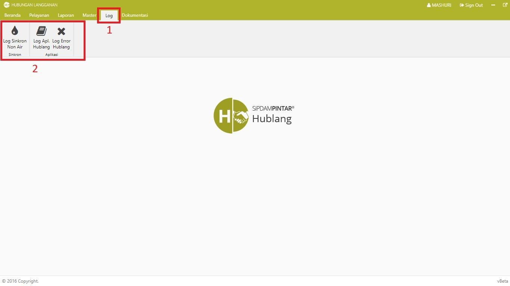

= Menampilkan Log

_Log_ dalam Modul Hublang berfungsi untuk merekam segala riwayat pemakaian dari aplikasi. Berikut adalah cara untuk menampilkan _log_ pada modul:

1. Pilih menu *Log*, selanjutnya pilih jenis *Log* yang ingin Anda tampilkan baik *aktifitas*, *sinkronisasi* maupun *error* pada sistem. 
2. Sistem akan menampilkan log sesuai pilihan.

