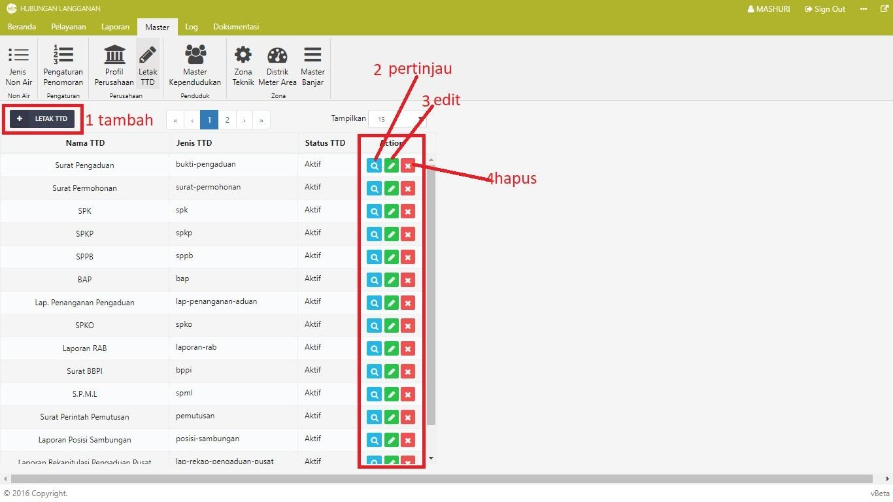
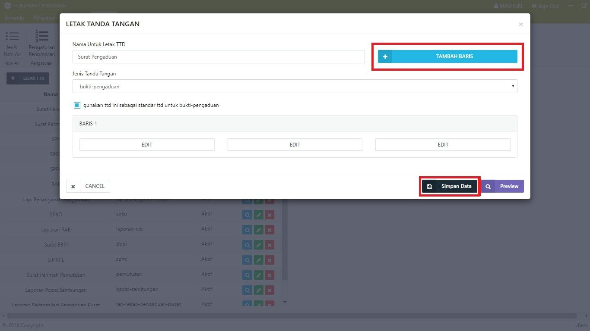
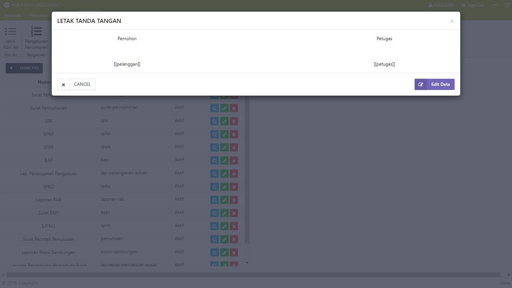
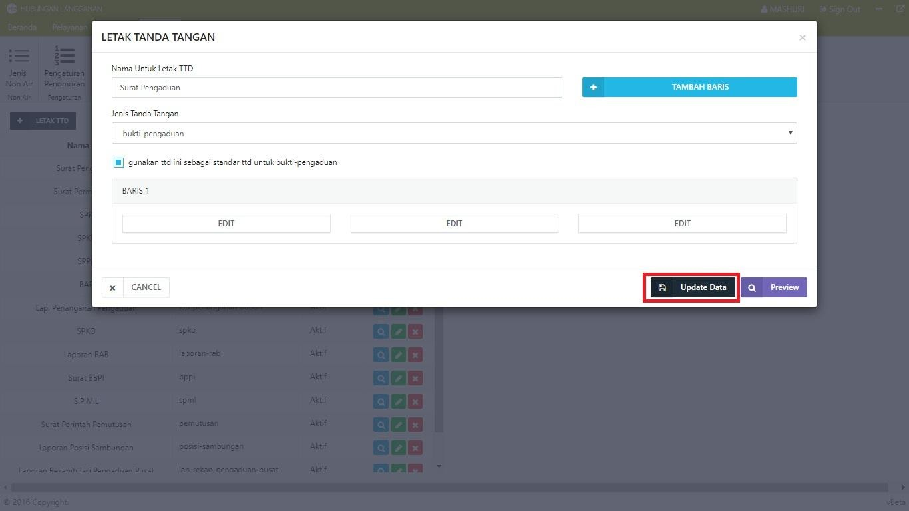

= Mengatur Tata Letak Tanda Tangan pada Surat

Dalam Modul Hublang, Anda dapat melakukan pengaturan tanda tangan, baik menambah, mengubah letak, maupun menghapusnya. Ikuti langkah-langkah berikut untuk mengatur tanda tangan:

1. Untuk menambah *tanda tangan*, klik tombol *Letak TTD*. Selanjutnya isi form letak tanda tangan, seperti *nama untuk letak tanda tangan*, *jenis tanda tangan*, dan *baris tanda tangan*. Setelah data terisi dengan benar, klik  tombol *Simpan Data*. 
+

2. Untuk melihat hasil tata letak tanda tangan yang sudah pernah dibuat, klik ikon *preview*, Selanjutnya akan muncul *pop up* hasil tanda tangan yang sudah pernah dibuat sebelumnya.
+

3. Untuk memperbarui data, klik ikon *Edit*. Setelah itu, ubah format tanda tangan lalu klik tombol *Update Data*.
+

4. Untuk menghapus data format tanda tangan, klik ikon *Hapus*. Setelah Anda klik tombol tersebut, akan muncul *pop up*. jika Anda yakin menghapus data, klik tombol *Ya*, *Hapus Data*. Jika tidak, tekan tombol *Tidak*, *Terima Kasih*.
+
