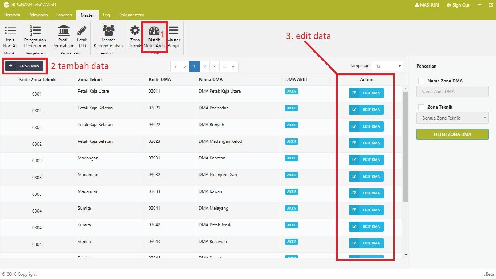
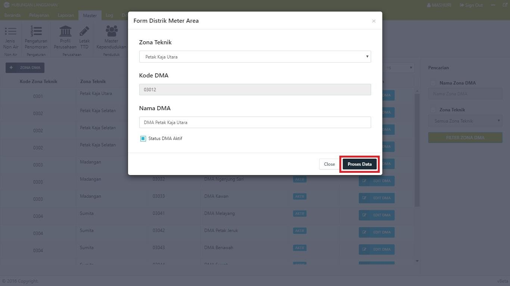

= Mengelola Data Distrik Area

Dalam Modul Hublang, Anda dapat melakukan pengelolaan data distrik area, baik menambah maupun memperbarui. Ikuti langkah-langkah berikut untuk mengelola data:

1. Pilih *Menu Master*, kemudian klik ikon *Data Master Area*.

2. Untuk menambahkan data distrik area, tekan tombol *Zona DMA*. Input data zona sesuai form. Setelah data yang Anda masukkan benar, klik tombol *Proses Data*.

3. Untuk memperbarui data distrik area, tekan tombol *Edit DMA*. Edit data distrik area yang Anda inginkan, lalu klik tombol *proses data*.
+
