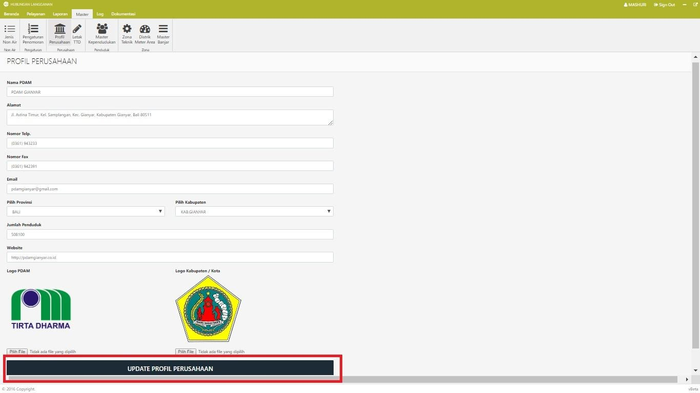

= Mengelola Data Informasi Perusahaan

Untuk mengelola data profil PDAM, ikuti langkah-langkah berikut:

1. Pilih menu *Master*
2. Klik pada *Profil Perusahaan*
3. Ubah data profil PDAM sesuai kebutuhan
4. Pastikan untuk klik pada tombol *UPDATE PROFIL PERUSAHAAN* untuk menyimpan perubahan data.

