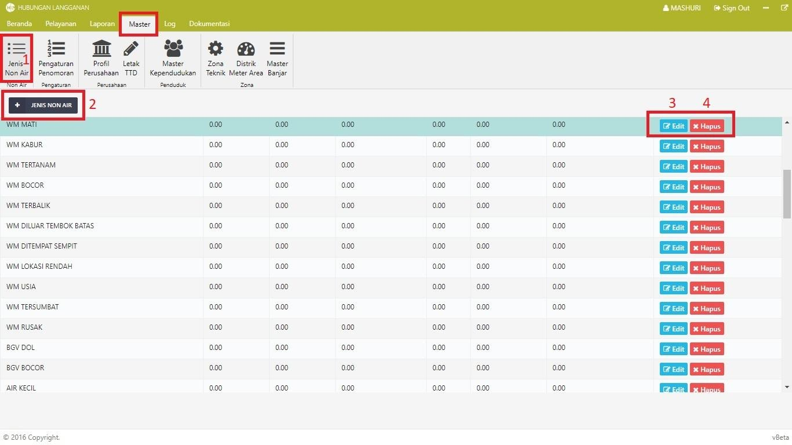
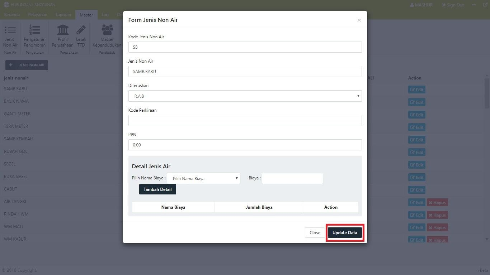
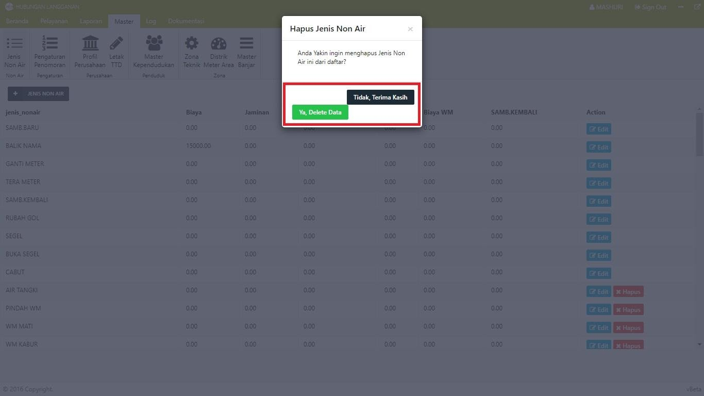

= Mengelola Data Jenis Non Air

Dalam Modul Hublang, Anda dapat melakukan pengelolaan data jenis non air, seperti menambah, memperbarui dan menghapus data. Ikuti langkah-langkah berikut untuk mengelola data: 

1. Untuk menambah data jenis non air, Pilih menu master, cari ikon *Jenis Non-Air*.

2. Klik tombol *Jenis Non-Air*, lalu input data sesuai dengan _form_ penambahan jenis non air. Setelah data terisi dengan benar, klik tombol *Simpan Data*.
+

3. Untuk memperbarui data, klik tombol *Edit*. Selanjutnya, ubah _field_ yang ingin diperbarui, lalu klik tombol *Update Data*.
+

4. Untuk menghapus data jenis non air, klik tombol *Hapus*. Sistem akan memunculkan _pop up_. Jika Anda yakin untuk menghapus data, klik tombol *Ya*, *Delete Data*. Jika tidak, klik tombol *Tidak*, *Terima Kasih*.
+
