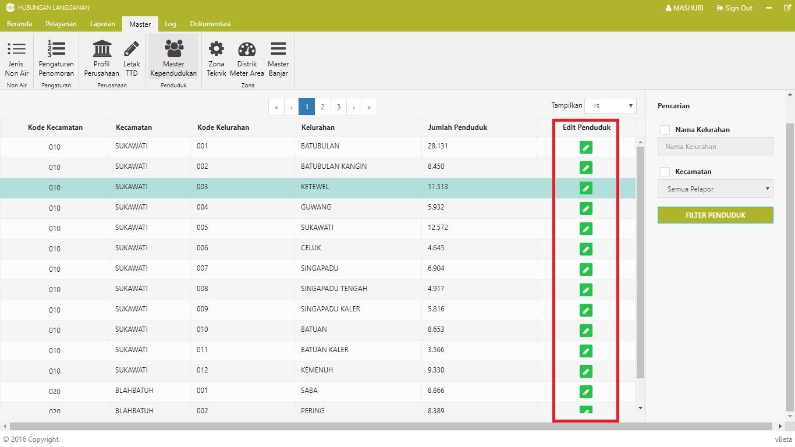
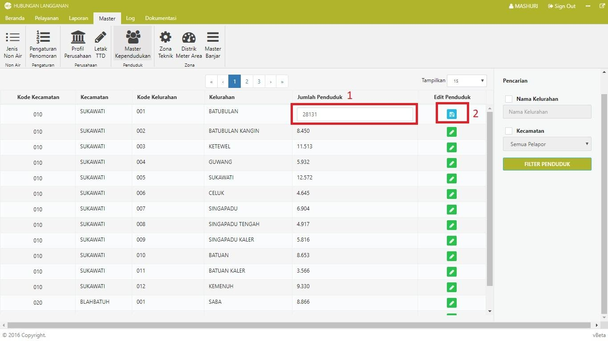

= Mengelola Data Kependudukan

Ikuti langkah-langkah berikut untuk mengelola data kependudukan:

1. Klik ikon *Edit*, kemudian pilih dan ubah data pada _cell_ sesuai kebutuhan.
+

2. Untuk menyimpan perubahan, klik ikon *Simpan*. 
+
