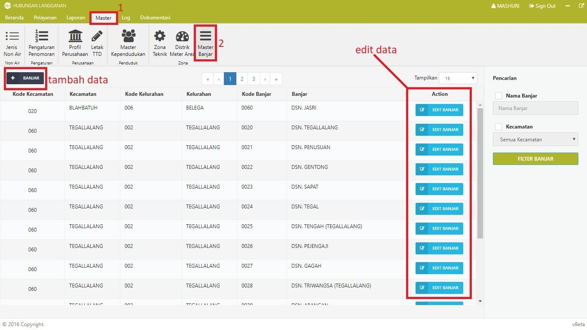
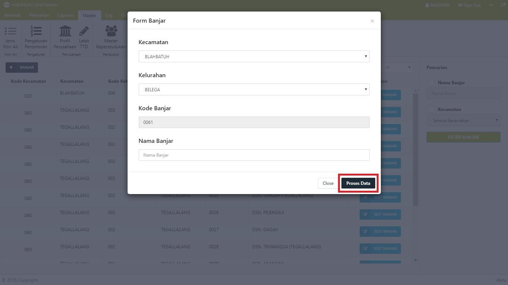

= Mengelola Data Wilayah PDAM

Dalam Modul Hublang, Anda dapat melakukan pengelolaan data wilayah PDAM, seperti menambah dan memperbarui data. Ikuti langkah-langkah berikut untuk mengelola data:

1. Untuk menambahkan *data sesuai wilayah*, klik tombol *sesuai dengan nama wilayah*, kemudian input Data Wilayah sesuai _form_. Setelah data yang Anda inputkan benar, simpan dengan klik tombol *Proses Data*.

2. Untuk memperbarui data wilayah, Anda dapat klik tombol *Edit Wilayah*. Ubah data wilayah yang sesuai kebutuhan, kemudian klik tombol *Proses Data*.
+

