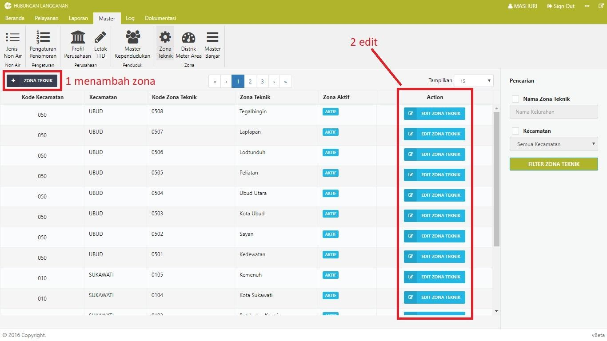
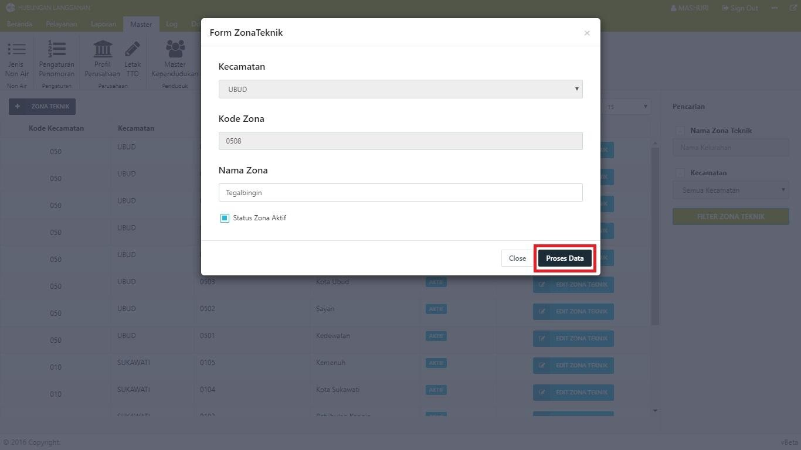

= Mengelola Data Zona Teknik

Dalam Modul Hublang, Anda dapat melakukan pengelolaan data zona teknik, seperti menambah dan memperbarui data. Ikuti langkah-langkah berikut untuk mengelola data:

1. Untuk menambahkan data zona, klik tombol *Zona Teknik*, kemudian input data zona. Setelah data diinput, klik tombol *Proses Data*. 

2. Untuk memperbarui data zona, klik tombol *Edit Data Zona*. Ubah data, kemudian klik tombol  *Proses Data*.
+
Berikut adalah tampilan halaman tambah dan edit data zona teknik :
+
