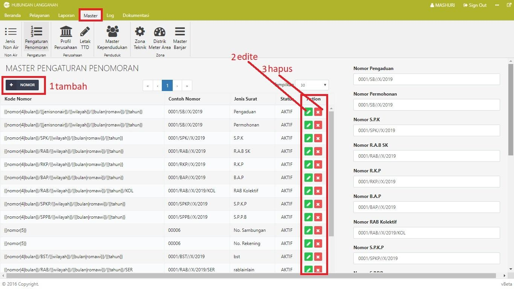
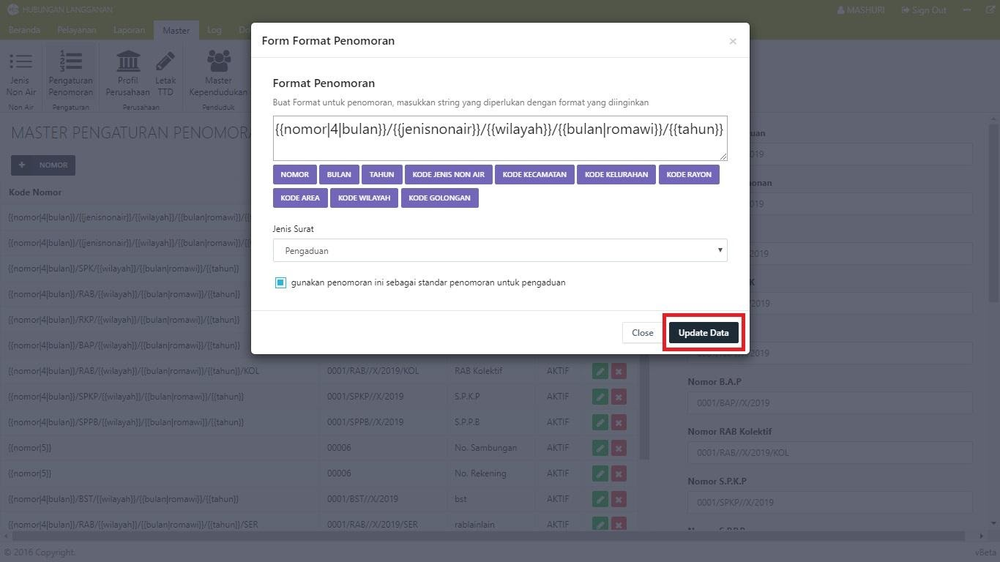
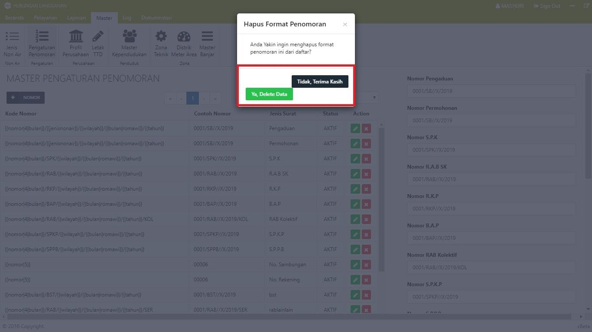

= Mengelola Format Penomoran Surat

Dalam Modul Hublang, Anda dapat melakukan pengelolaan format penomoran surat, seperti menambah, memperbarui dan menghapus data. Ikuti langkah-langkah berikut untuk mengelola data: 

1. Untuk menambah data nomor surat, klik tombol *Nomor*. Selanjutnya isi form penambahan nomor surat. Setelah data terisi, klik tombol *Simpan Data*.
+

2. Untuk memperbarui data, klik ikon *Edit*. Setelah mengubah data, klik pada tombol *Update Data*.
+

3. Untuk menghapus data jenis non air, klik pada tombol *Hapus* hingga muncul _pop up_. Untuk melanjutkan proses, klik tombol *Ya*, *Delete Data*. Untuk membatalkan, klik tombol *Tidak*, *Terima Kasih*.
+
