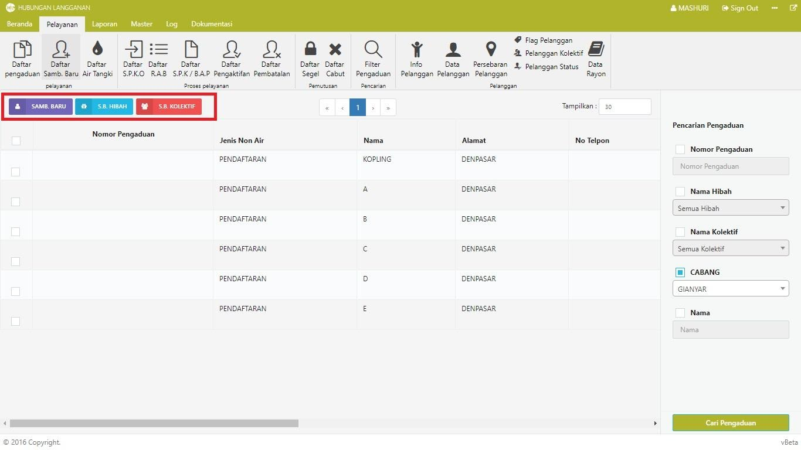
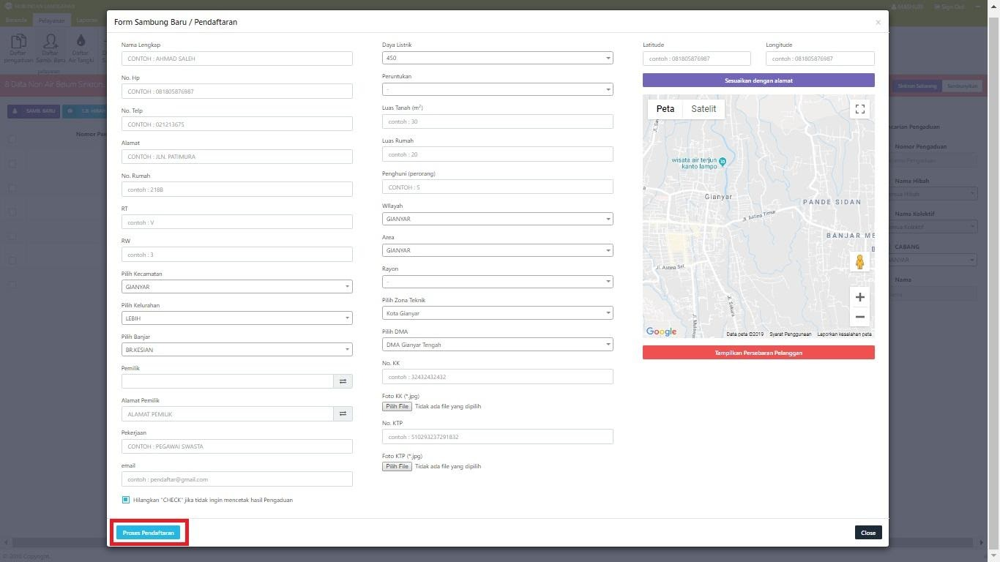
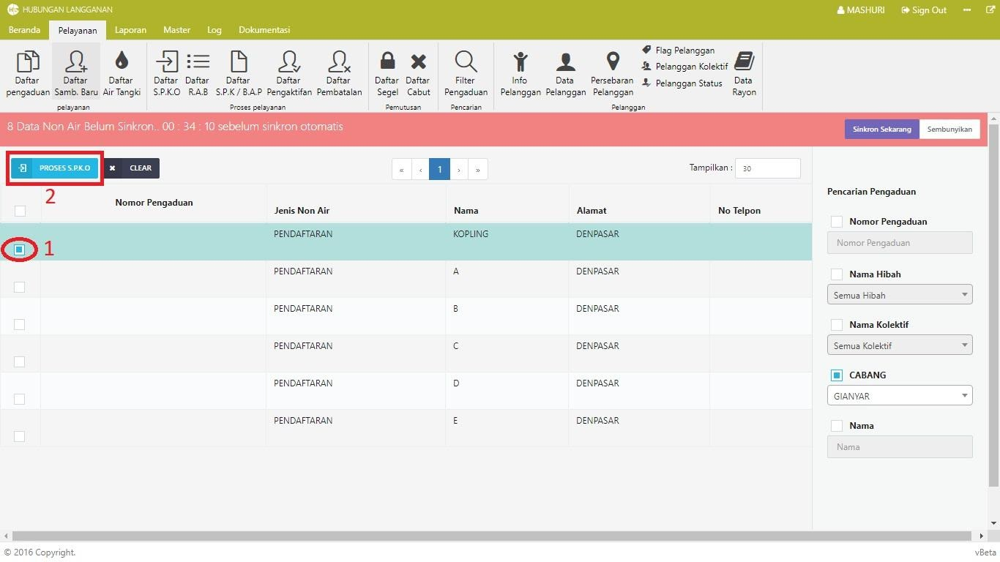
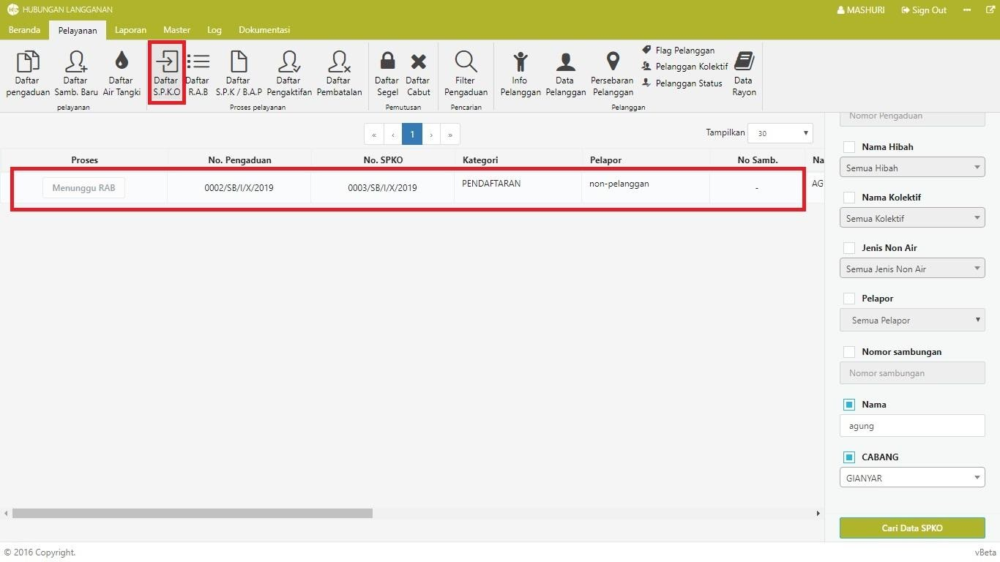
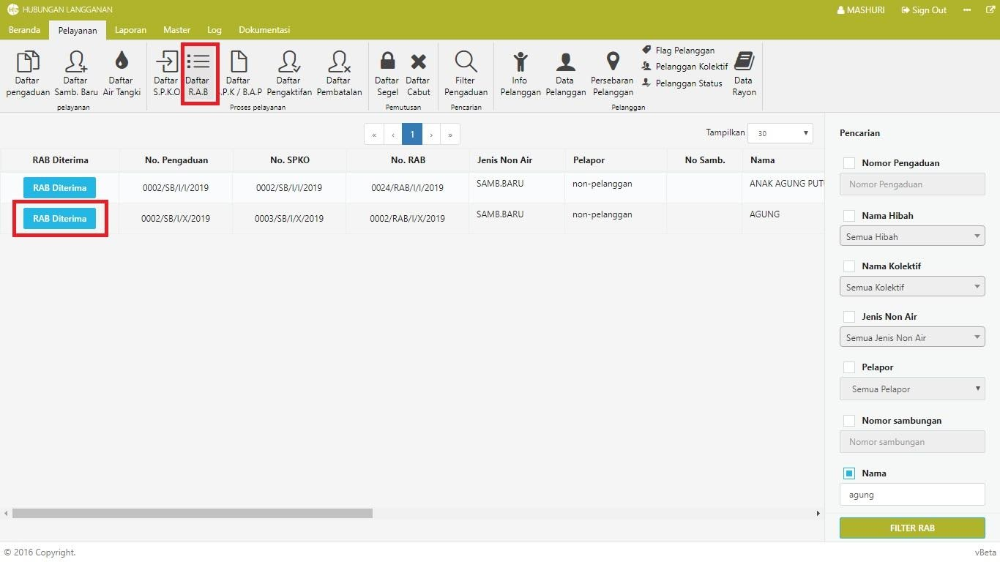
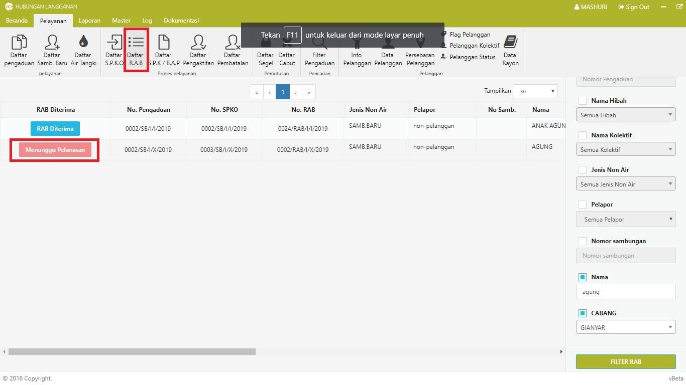
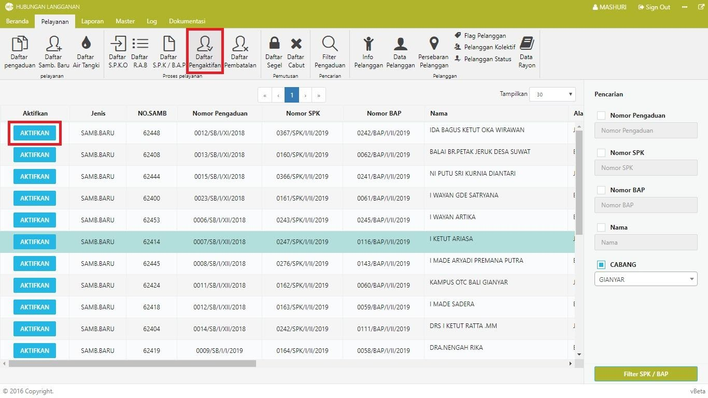

= Membuat Sambungan Baru

Untuk membuat sambungan baru, ikuti langkah-langkah berikut:

1. Pilih *Menu Pelayanan*, kemudian klik ikon *Daftar Sambungan Baru*. Terdapat 3 tipe sambungan baru yang Anda dapat pilih, yaitu *Sambungan Baru Biasa*, *Sambungan Baru Hibah*, dan *Sambungan Baru Kolektif*. 

+

2. Setelah memilih tipe sambungan baru yang akan dibuat, lengkapi data sesuai form pendaftaran kemudian klik tombol *Proses Pendaftaran*.

+

3. Jika data yang diinput sudah benar, maka data akan muncul pada tabel daftar sambungan baru. Untuk melanjutkan proses pendaftaran sambungan baru, berikan tanda cek pada daftar sambungan yang akan diproses, kemudian klik tombol *Proses SPKO*. 

+

4. Untuk memeriksa apakah data sudah diproses, Anda dapat melihat pada *Daftar SPKO*. Sistem akan menampilkan tabel SPKO dengan status *Menunggu RAB*. Data tersebut nantinya akan dilakukan proses diperiksa dan diproses oleh bagian *Perencanaan*.

+

5. Semua data sambungan baru pada daftar SPKO yang telah diproses oleh bagian *Perencanaan* dapat dilihat pada *Daftar RAB*. Untuk melanjutkan proses pembayaran, klik tombol *RAB Diterima* pada data yang ingin diproses. 

+

6. Ketika sudah melanjutkan proses pembayaran, data akan dikirim pada bagian *Loket* untuk melakukan proses pelunasan dari calon pelanggan. Pada kolom *RAB diterima* status akan diubah menjadi *Menunggu Pelunasan*.

+

7. Ketika calon pelanggan sudah melakukan pembayaran pada loket, selanjutnya data dikirim pada bagian Distribusi untuk kemudian dilakukan proses *pembuatan SPK*, *SPPB*, *Pemasangan*, dan *BAP*. 

8. Setelah semua proses pada Distribusi terpenuhi, data kembali dikirim pada bagian Hubungan Langganan. Data dapat dilihat pada tabel *Daftar Pengaktifan*. Tahap terakhir yaitu merubah status calon pelanggan menjadi pelanggan dengan cara menekan tombol *Aktifkan*. 

+

