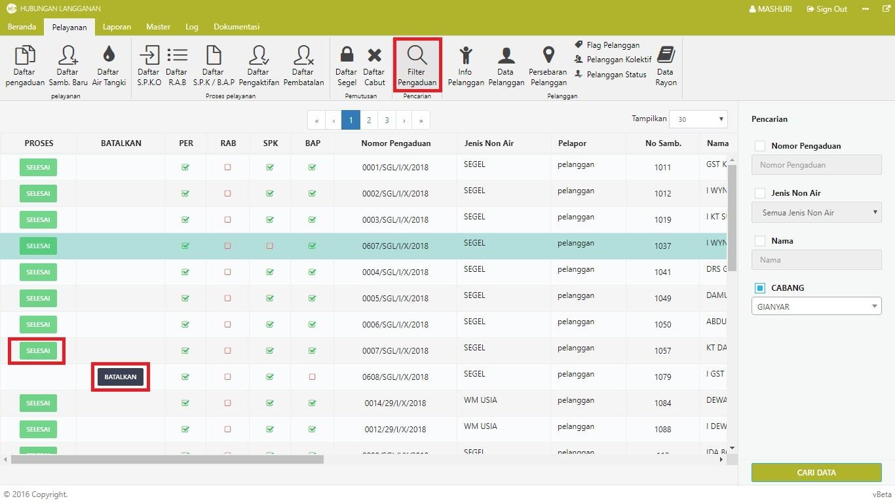

= Memfilter dan Membatalkan Pengaduan

Untuk membuat menyaring data dan membatalkan pengaduan, ikuti langkah-langkah berikut:

1. Untuk memuncul seluruh pengaduan yang pernah dibuat, pilih *Menu Pelayanan* kemudian pilih ikon *Filter Pengaduan*. Jika terdapat data pengaduan yang pernah dibuat sebelumnya, data akan secara otomatis muncul pada tabel. 

2. Jika pada kolom *proses* terdapat status pengaduan *SELESAI*, berarti pengaduan telah selesai ditindaklanjuti oleh pihak PDAM. Jika tidak terdapat status *SELESAI*, maka pengaduan masih dalam proses tindak lanjut dan dapat dilakukan proses pembatalan

3. Proses pembatalan dapat dilakukan dengan menekan tombol *BATALKAN* pada kolom *BATALKAN*.

