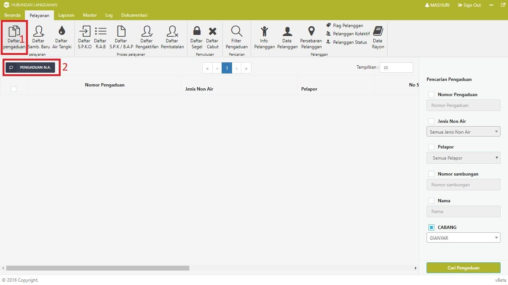

= Memproses Pengaduan

Berikut adalah langkah-langkah untuk memproses pengaduan: 

1. Pilih *Menu pelayanan*, kemudian klik ikon *Daftar Pengaduan*.

2. Klik tombol *PENGADUAN N.A*.

3. Untuk pengaduan pelanggan PDAM yang telah terdaftar, masukkan nomor sambungan secara langsung kemudian klik tombol *Cek Data Pelanggan*. Untuk pengaduan non-pelanggan PDAM, klik pada tombol *Tidak Memiliki No Sambungan*.

+

4. Isi form pengaduan. Jika semua data sudah terisi dengan benar, klik tombol *Simpan Data*. 

+

5. Jika berhasil disimpan, maka data akan muncul pada tabel daftar pengaduan. 

Untuk melanjutkan proses pengaduan, ikuti langkah-langkah berikut :

1. Akses kembali halaman Daftar Pengaduan
2. Klik pada checkbox data yang perlu diproses
3. Klik tombol *PROSES S.P.K.O*. 
4. Jika proses SPKO sudah dilakukan, data dapat dilihat pada halaman *Daftar S.P.K.O* dengan status *Menunggu SPK* pada kolom proses. Hal tersebut menunjukkan bahwa data tersebut telah dikirim pada bagian *Distribusi* untuk dilakukan proses SPK, SPPB, proses perbaikan, dan BAP. Jika semua proses sudah dikerjakan, maka pengaduan telah selesai.

