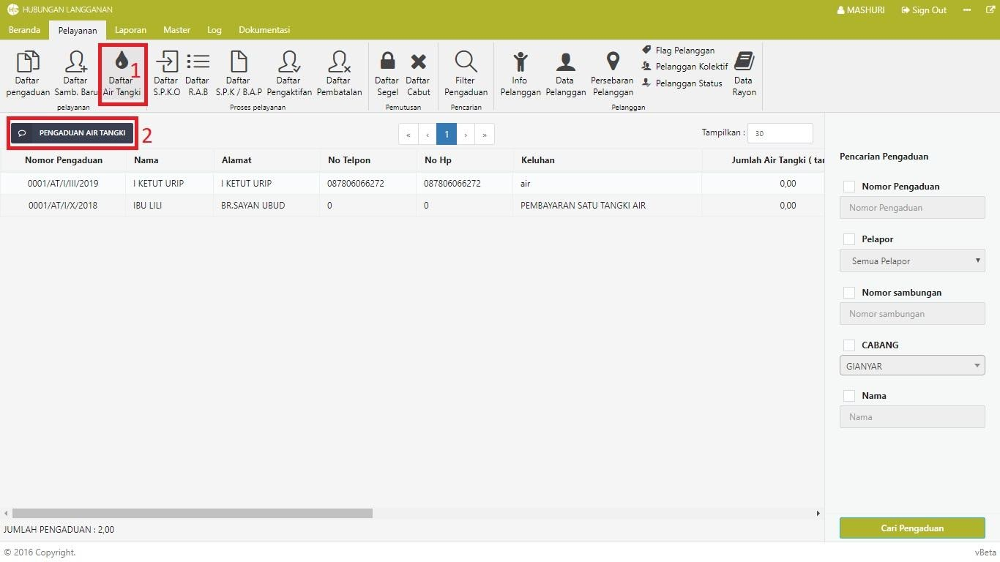
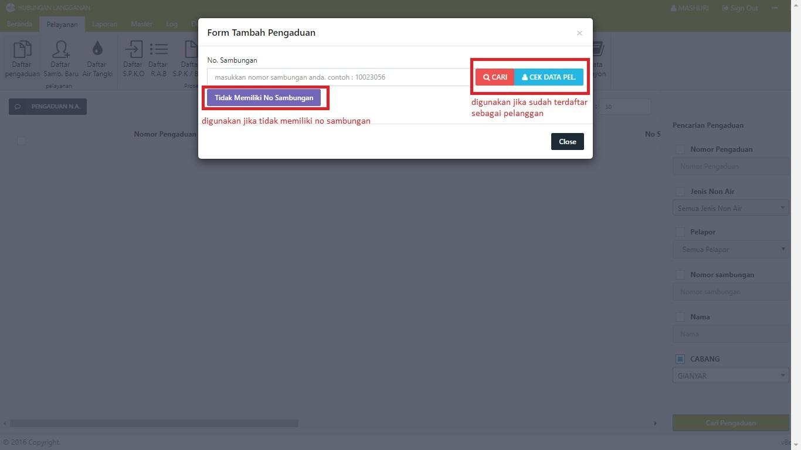
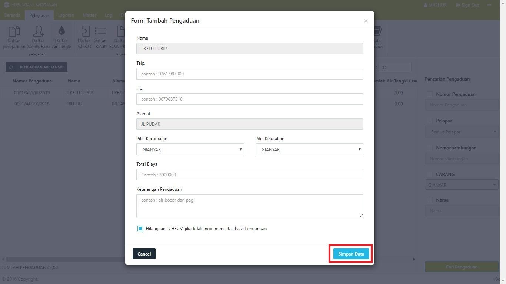

= Membuat Daftar Pembelian Air Tangki

Berikut adalah langkah-langkah untuk pembelian air tangki:

1. Untuk membuat pembelian air tangki, Anda dapat mengakses *Menu Pelayanan*, klik ikon *Daftar Air Tangki*, kemudian klik tombol *Pengaduan Air Tangki*. 

2. Untuk pembeli yang telah terdaftar sebagai pelanggan PDAM, memasukan nomor sambungan kemudian klik tombol *Cek Data Pelanggan*. Untuk pembeli yang tidak terdaftar sebagai pelanggan, klik pada tombol *Tidak Memiliki No Sambungan*.
+

3. Pada form yang disediakan, isi semua data kemudian klik tombol *Simpan Data*.
+

4. Jika data berhasil disimpan, data akan muncul pada tabel daftar air tangki. Data tersebut akan dikirim pada bagian Loket untuk kemudian dilakukan proses pembayaran.

