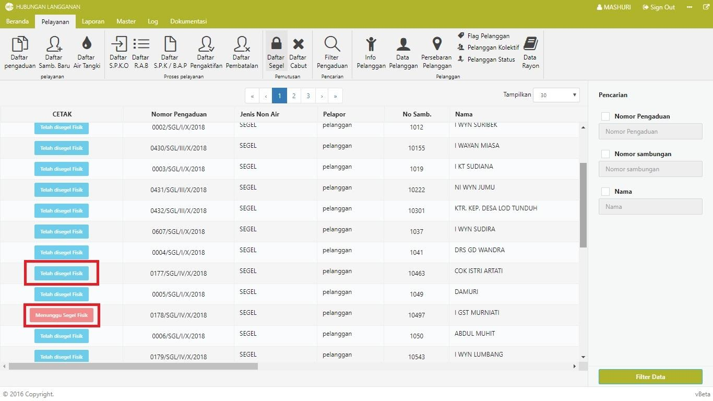

= Menampilkan Daftar Segel

Untuk menampilkan daftar segel, ikuti langkah-langkah berikut: 

1. Klik pada *Penu Pelayanan*, kemudian pilih ikon *Daftar Segel*. Pada menu ini akan tersedia data pelanggan yang telah disegel maupun akan dilakukan proses segel secara otomatis.
+

2. Pada daftar segel, terdapat kolom *CETAK* yang menunjukkan status segel masing-masing pelanggan. Status *Telah Disegel Fisik* menunjukkan bahwa sambungan pelanggan telah disegel, sementara status *Menunggu Segel Fisik* menunjukkan bahwa sambungan pelanggan masih dalam proses penyegelan.

