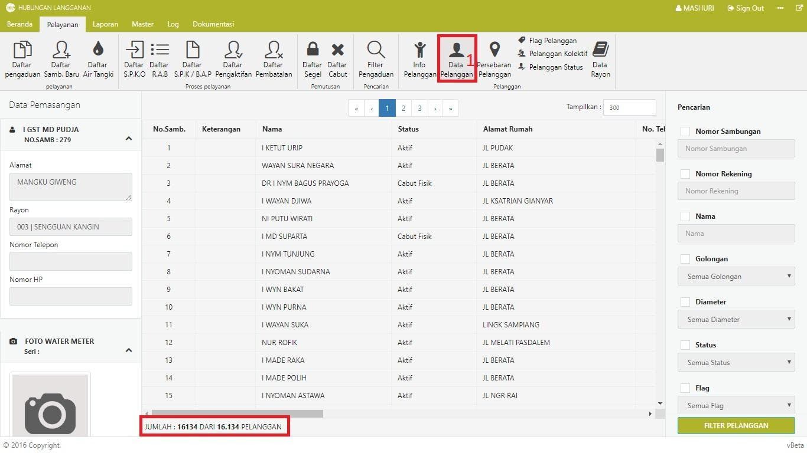

= Menampilkan Data Pelanggan

Untuk menampilkan data pelanggan, ikuti langkah-langkah berikut: 

1. Klik pada *Menu pelayanan*, selanjutnya cari ikon *Data Pelanggan*
2. Data akan secara otomatis ditampilkan pada tabel daftar pelanggan. 
3. Klik pada salah satu data, maka detail data akan ditampilkan pada bagian kiri halaman.
4. Untuk mempermudah pencarian data, gunakan filter yang disediakan pada bagian kanan halaman.

