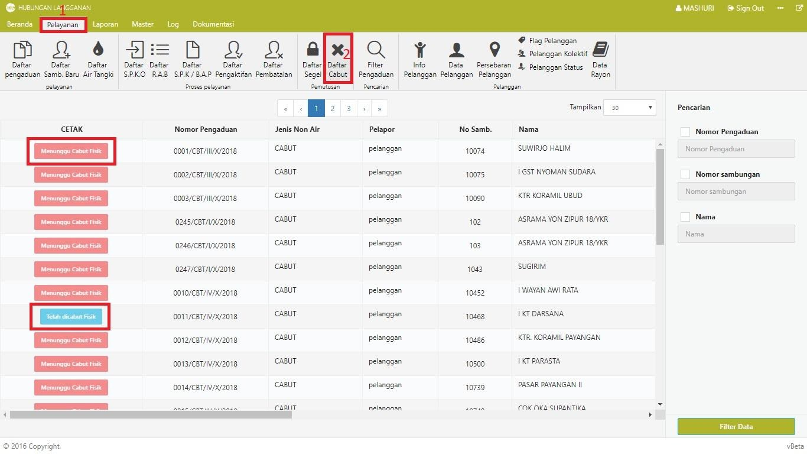

= Menampilkan Data Pengaduan Cabut Meter

Untuk menampilkan data pengaduan cabut meter, ikuti langkah-langkah berikut: 

1. Klik pada *Menu Pelayanan*
2. Klik ikon *Daftar Cabut*. Sistem akan menampilkan data cabut meter dalam bentuk tabel.
3. Pada tabel, terdapat kolom *CETAK* yang menunjukkan status cabut masing-masing meteran pelanggan. Status *Telah Dicabut Fisik* menunjukkan bahwa meteran pelanggan telah dicabut, sementara status *Menunggu Cabut Fisik* menunjukkan bahwa meteran pelanggan masih dalam proses pencabutan.

