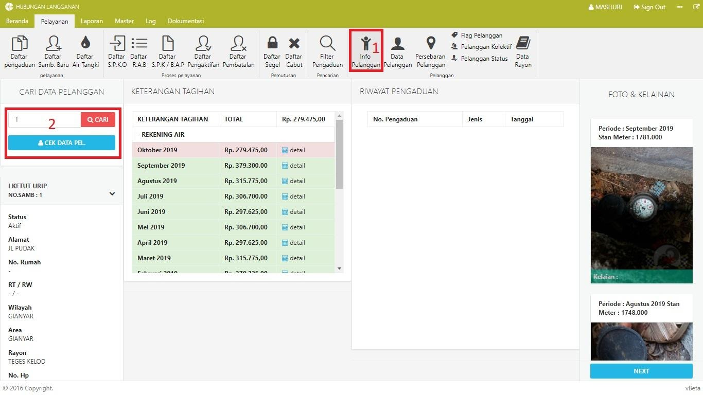

= Menampilkan Informasi Pelanggan

Untuk menampilkan informasi pelanggan, ikuti langkah-langkah berikut: 

1. Klik pada *Menu pelayanan*, kemudian klik ikon *Info Pelanggan*
2. Masukan nomor sambungan pelanggan, kemudian klik tombol *Cari*. 
3. Jika data yang diinputkan benar, maka data pelanggan akan secara otomatis ditampilkan oleh sistem. Data yang ditampilkan mencakup detail info pelanggan, keterangan tagihan, dan riwayat pengaduan berikut dengan foto dan kelainannya.

