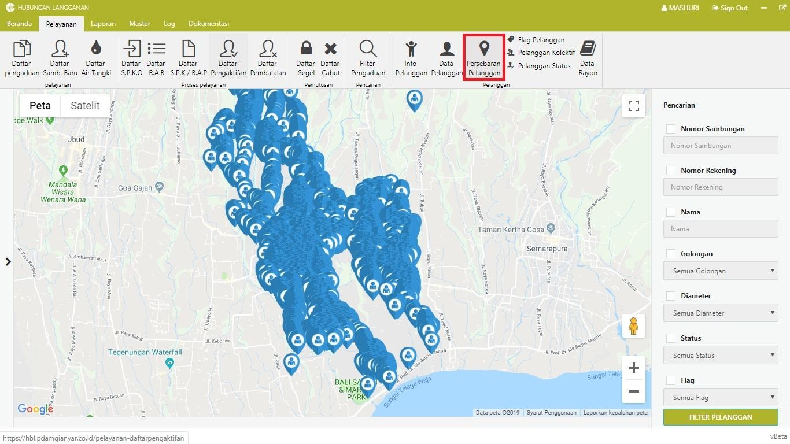

= Menampilkan Pesebaran Pelanggan

Untuk menampilkan persebaran pelanggan dalam wilayah PDAM, ikuti langkah-langkah berikut: 

1. Klik pada *Menu pelayanan*, kemudian klik ikon *Persebaran Pelanggan*. 
2. Data pelanggan secara otomatis dipetakan dalam bentuk _maps_ sesuai letak sambungan atau meteran masing-masing.
3. Anda dapat mencari letak sambungan tertentu dengan menggunakan filter di sebelah kanan halaman.