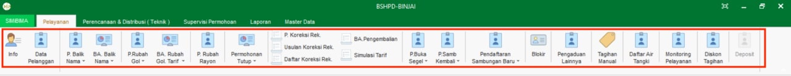

= Menu Modul Hublang

Berikut deskripsi secara umum dari menu yang ada pada Modul Hublang : 

.Menu Pelayanan
[%collapsible]
====

1. Ikon *Info* menyediakan info mengenai data dari pelanggan dan menyediakan menu yang dapat melihat data dari pelanggan secara detail, yaitu *Data Pelanggan*, *Histori Pembacaan Meter*, *Tagihan*, *Histori Pembayaran*, *Histori Berita Acara*, *Foto Rumah*, dan *Denah Sambungan Baru*.ß
2. Ikon *Data Pelanggan* menyediakan menu untuk melihat data pelanggan dan koreksi data pelanggan.
3. Ikon *Permohonan Balik Nama* dapat digunakan untuk menampilkan, mengoreksi, dan menghapus data permohonan balik nama, serta menambahkan permohonan balik nama baru.
4. Ikon *Berita Acara Balik Nama* dapat digunakan untuk menampilkan, mengoreksi, dan menghapus berita acara balik nama yang telah dibuat sebelumnya, serta menambahkan berita acara balik nama baru.
5. Ikon *Permohonan Rubah Golongan* dapat digunakan untuk menampilkan, mengoreksi, dan menghapus permohonan rubah golongan yang telah dibuat sebelumnya, serta menambahkan permohonan rubah golongan baru.
6. Ikon *Berita Acara Rubah Golongan Tarif* dapat digunakan untuk melihat data Berita Acara Rubah Golongan Tarif. Menu ini menyediakan Filter Pencarian data dan Cetak Data Berita Acara Golongan Tarif.
7. Ikon *Permohonan Rubah Rayon* digunakan untuk memenuhi permohonan perubahan rayon dari pelanggan. Menu ini dapat digunakan secara individu maupun kolektif.
8. Ikon *Permohonan Tutup* digunakan untuk memenuhi permintaan atau permohonan tutup rekening dari pelanggan. Menu ini digunakan untuk menambah dan mencari data Permohonan Tutup dari Pelanggan.
9. Ikon *P.Koreksi Rek*  digunakan untuk mengoreksi rekening pelanggan. Menu ini menyediakan fitur untuk menambah, menghapus, mengoreksi, dan mencetak Permohonan Koreksi Rekening.
10. Ikon *Usulan Koreksi Rek* digunakan untuk mengusulkan pelaksanaan koreksi rekening pelanggan. Menu ini menyediakan fitur untuk Menambah, Menghapus dan mencari data Usulan Koreksi Rekening.
11. Ikon *Daftar Usulan Rek* digunakan untuk menampilkan daftar koreksi rekening milik pelanggan, yang dilengkapi dengan fitur filter.
12. Ikon *BA. Pengembalian* dapat digunakan untuk menampilkan data berita acara pengembalian.
13. Ikon *Simulasi Tarif* digunakan untuk membuat perkiraan atau simulasi tarif yang akan dibayarkan oleh pelanggan. Menu ini dilengkapi dengan fitur untuk mendapat hasil kalkulasi parameter yang sudah diinputkan secara otomatis.
14. Ikon *P. Buka Segel* digunakan untuk membuat permohonan buka segel dari pelanggan. Menu ini mencakup fitur untuk menambah, menghapus, mengoreksi, mencetak, dan mencari data Permohonan Buka Segel.
15. Ikon *P. Samb Kembali* digunakan untuk membuat permohonan sambung kembali dari pelanggan. Menu ini dilengkapi dengan fitur untuk menambah, menghapus, mengoreksi, mencetak, dan mencari data Permohonan Sambungan Kembali.
16. Ikon *Pendaftaran Sambungan Baru* digunakan untuk melayani pendaftaran sambungan baru untuk pelanggan. Menu ini dilengkapi dengan fitur untuk menambah, menghapus, mengoreksi, mencetak, dan mencari data Pendaftaran Sambungan Baru.
17. Ikon *Blokir* digunakan untuk mengatur pemblokiran layanan pelanggan bermasalah berdasarkan pengaduan dari petugas baca. Menu ini mencakup fitur untuk mencari data blokir pelanggan, memperbarui status blokir pelanggan, mencetak surat tugas pengecekan kembali untuk petugas baca, hingga _export_ data dalam bentuk xls.
18. Ikon *Pengaduan Lainnya* digunakan untuk melayani pengaduan yang masuk dari pelanggan, baik pengaduan pipa bocor, stop kran tidak berfungsi, dan lain-lain. Menu ini mencakup fitur untuk menambah, menghapus, mengoreksi, mencetak, dan mencari data berbagai pengaduan tersebut.
19. Ikon *Tagihan Manual* digunakan untuk melayani tagihan yang bersifat manual. Menu ini dilengkapi dengan fitur untuk menambah, menghapus, mengoreksi, mencetak, dan mencari data Tagihan Manual.
20. Ikon *Daftar Air Tangki* digunakan untuk melayani dan melihat daftar tangki pelanggan. Menu ini mencakup fitur untuk menambah, menghapus, mengoreksi, mencetak, dan mencari data Air Tangki.
21. Ikon *Monitoring Pelayanan* digunakan untuk melakukan _monitoring_ pelayanan yang ada dalam sistem. Menu ini menyediakan fitur untuk menampilkan, memfilter, dan mencetak data layanan.
22. Ikon *Diskon Tagihan* dapat digunakan untuk potongan harga tagihan pembayaran yang berlaku setiap saat.
23. Ikon *Deposit* dapat digunakan untuk pembayaran yang berlaku pada rekening berjalan.
====

.Menu Supervisi Permohonan
[%collapsible]
====

1. Ikon *Daftar Tunggu Proses Data Supervisi* menyediakan menu untuk supervisi dan validasi proses data yang sudah masuk dalam daftar.
====

.Menu Laporan
[%collapsible]
====

1. Ikon *Pengaduan* menyediakan filter untuk mencari rekap laporan pengaduan yang ditampilkan dalam format PDF.
2. Ikon *Laporan Berita Acara dan Lainnya* menyediakan filter untuk mencari rekap laporan, berita acara dan bon yang ditampilkan dalam format PDF.
3. Ikon *Penyelesaian Blokir* menyediakan filter untuk mencari rekap laporan penyelesaian yang ditampilkan dalam format PDF.
4. Ikon *Daftar Koreksi Rekening* menyediakan filter untuk mencari rekap daftar koreksi rekening penyelesaian yang ditampilkan dalam format PDF.
5. Ikon *Laporan Lainnya* menyediakan filter untuk mencari rekap laporan yang ditampilkan dalam format PDF.
6. Ikon *Log User Akses* untuk melihat aktifitas user yang masuk ke dalam sistem.
====

.Menu Master Data
[%collapsible]
====
image::../images-hublang/hublang-master-data.png[align="center"]

1. Ikon *Material* menyediakan menu untuk menampilkan data material yang digunakan. Pada menu ini, Anda dapat menambah data material baru, mengoreksi, dan menghapus material yang telah dibuat.
2. Ikon *Ongkos* menyediakan menu untuk menampilkan ongkos/biaya saat melakukan kegiatan. Pada menu ini, Anda dapat menambah data ongkos/biaya baru, mengoreksi, dan menghapus ongkos/biaya yang telah dibuat.
3. Ikon *Paket Material* Perencanaan menyediakan menu untuk menampilkan paket material yang akan digunakan. Pada menu ini, Anda dapat menambah data paket material perencanaan baru, mengoreksi, dan menghapus paket material perencanaan yang telah dibuat.
4. Ikon *Paket Ongkos* menyediakan menu menyediakan menu untuk menampilkan paket ongkos saat melakukan kegiatan. Pada menu ini, Anda dapat menambah data paket ongkos baru, mengoreksi, dan menghapus  data paket ongkos baru yang telah dibuat.
5. Ikon *Paket RAB* menyediakan menu untuk menampilkan paket RAB yang saat melakukan kegiatan. Pada menu ini, Anda dapat menambah data paket RAB, mengoreksi, dan menghapus paket RAB yang telah dibuat.
6. Ikon *Jenis Nonair* menyediakan menu untuk menampilkan list ongkos jenis nonair yang akan dibebankan pada pelanggan. Pada menu ini, Anda dapat menambah data ongkos jenis nonair, mengoreksi, dan menghapus data ongkos jenis nonair yang telah dibuat.
7. Ikon *Tarif Air Tangki* menyediakan menu untuk menampilkan daftar Tarif Air Tangki. Pada menu ini, Anda dapat menambah data Tarif Air Tangki, mengoreksi, dan menghapus data Tarif Air Tangki yang telah dibuat.
====