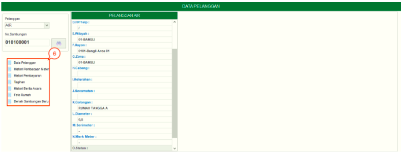

= Melihat Detail Pelanggan
 

Menu Info menampilkan informasi yang meliputi *Data Pelanggan*, *Histori Pembacaan Meter*, *Tagihan*, *Histori Pembayaran*, *Histori Berita Acara*, *Foto Rumah*, dan *Denah Sambungan Baru*. Berikut cara untuk melihat detail pelanggan :

1. Isilah informasi di kolom dropdown *Pelanggan* dengan cara memilih jenis tagihan (air) 
2. Masukkan *Nomor Sambungan*, kemudian tekan tombol *teropong* di sebelah kolom nomor sambungan. Untuk melakukan pencarian menggunakan *Nomor Sambungan Pelanggan*, Anda dapat langsung memasukan nomor sambungan. Data pelanggan akan secara otomatis ditampilkan tanpa klik pada Tombol *Search*
+
image::../images-hublang/hublang-detail-pelanggan-info-3.png[align="center"]

3. Berikutnya, input filter pencarian berdasarkan *Nama*, *Alamat*, *Nomor Sambungan* atau *no seri Meter*.
4. Tekan tombol *Cari*
5. Selanjutnya akan muncul tabel berisi daftar pelanggan air. Lakukan _double click_ pada salah satu daftar pelanggan.
+

6. User dapat menggunakan sub-fitur *Data Pelanggan*, *Histori Pembacaan Meter*, *Tagihan*, *Histori Pembayaran*, *Histori Berita Acara*, *Foto Rumah*, dan *Denah Sambungan Baru* untuk mengetahui detail info pelanggan.

*Berikut Penjelasan sub-fitur yang ada pada Menu Info :*

- *Data Pelanggan*
+
Digunakan untuk menampilkan informasi data pelanggan, sesuai dengan Nomor Sambungan. Berikut contoh tampilan informasi data pelanggan.
+

- *Hasil Pembacaan Meter*
+
Digunakan untuk menampilkan dan mencetak daftar informasi pembacaan meter pelanggan setiap bulan. Berikut tampilan data dari Hasil Pembacaan Meter.
+

+
Untuk mencetak daftar pembacaan meter pelanggan setiap bulan, dapat dilakukan dengan mengikuti langkah - langkah berikut:

+

+
1. Tekan tombol *Cetak*

+

+
2. Kemudian akan muncul halaman *Preview*

+
3. Jika ingin mencetak daftar pelanggan, maka tekan tombol *Print* pojok kiri

+ 
Di dalam sub-fitur Hasil Pembacaan Meter terdapat action *klik kanan*. Berikut adalah penjelasannya : 

+ 

+
.. *Lihat foto Stan* 
+    
digunakan untuk mencetak data stan sesuai dengan data yang dipilih

.. *Cetak Semua Foto* 
+
digunakan untuk mencetak semua foto dalam _grid_ pada semua data

.. *Cetak Riwayat Pembacaan*
+
digunakan untuk mencetak Riwayat Pembacaan sesuai dengan data yang dipilih 

.. *Desain* 
+
digunakan untuk mengatur tampilan dari hasil cetak

- *History Pembayaran*
+
Digunakan untuk melihat data Riwayat pembayaran pada setiap periode. Berikut tampilan data dari *History Pembayaran*.

+ 

- *Tagihan*
+
Digunakan untuk menampilkan data dan mencetak tagihan pada pelanggan.
Pada data tagihan ini, Anda dapat menampilkan semua data tagihan rekening atau menyembunyikan data rekening yang sudah dihapus secara akuntansi dengan klik _checkbox_ *Tampilkan Rekening Hapus Secara Akuntansi* pada bagian bawah sistem. 

+ 

- *History Berita Acara*
+
Digunakan untuk menampilkan dan mencetak data Riwayat Berita Acara.

- *Foto Rumah*
+
Digunakan untuk menampilkan data foto rumah dari pelanggan.

- *Denah Sambungan Baru*
+
Digunakan untuk menampilkan data foto Denah Sambungan Baru pelanggan.

