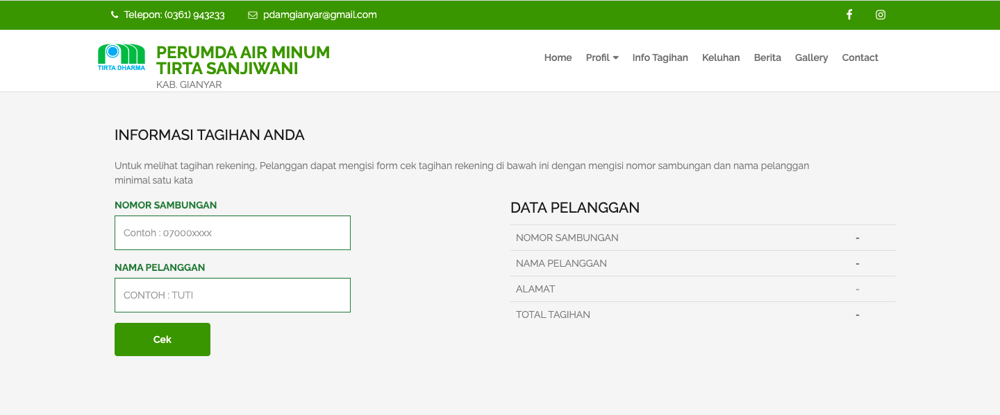
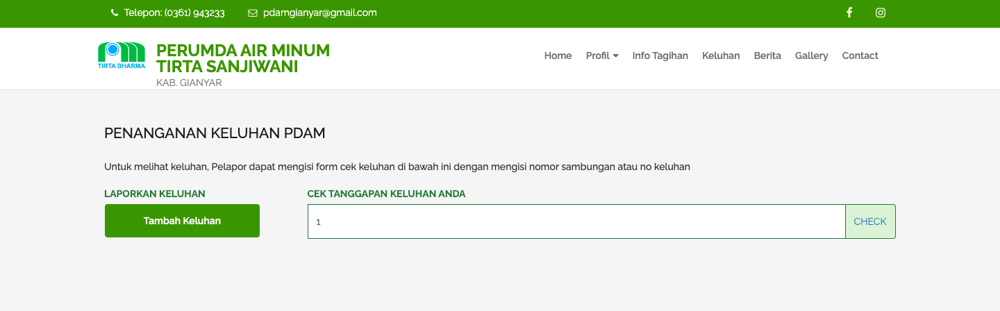
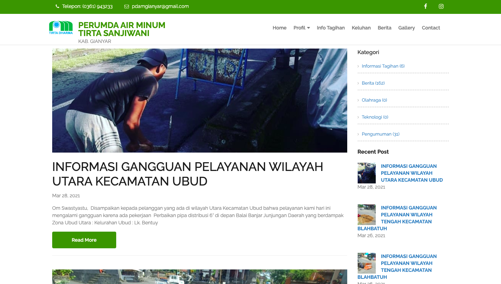

= Menu Info PDAM

Modul Info PDAM mencakup 3 menu utama, yaitu:

1. *Info Tagihan Pembayaran Air*
+
Menu Info Tagihan Pembayaran Air dapat digunakan oleh pelanggan untuk memeriksa tagihan pembayaran air masing-masing sesuai dengan nomor saluran dan nama pelanggan. Berikut ini adalah tampilan dari halaman info tagihan.
+

2. *Keluhan*
+
Menu Keluhan digunakan sebagai sarana bagi pelanggan untuk menyampaikan keluhan baik secara teknis maupun administratif. Keluhan teknis dapat mencakup kebocoran saluran air, matinya saluran air, air keruh, dan sebagainya sementara keluhan administratif dapat mencakup balik nama, penggantian alamat, dan sebagainya. 
+

3. *Berita*
+
Dengan menu ini, pelanggan dapat mengakses dan membaca berita terkait PDAM dengan berbagai macam topik. Berbagai berita disajikan dalam bentuk _list_ berdasarkan berita yang paling baru dirilis. Berikut ini adalah tampilan halaman Berita yang dapat pelanggan akses:
+

