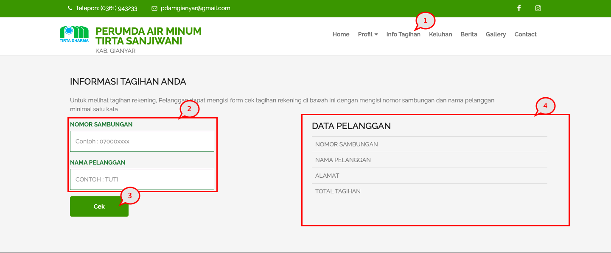

= Memeriksa Tagihan Rekening

Untuk memeriksa tagihan rekening air, Anda dapat mengikuti langkah-langkah berikut:

1. Pilih menu *Info Tagihan*.
2. Selanjutnya masukan *Nomor Sambungan* dan *Nama Pelanggan* pada _field_ yang tersedia.
3. Jika proses nomor 2 sudah selesai, Anda dapat menekan tombol *Cek* untuk mengetahui jumlah tagihan yang Anda harus bayar.
4. Sistem akan menampilkan detail data pelanggan beserta total tagihannya pada bagian kanan layar.
