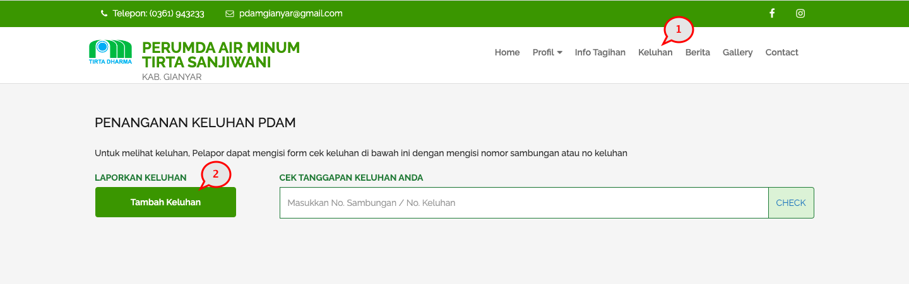
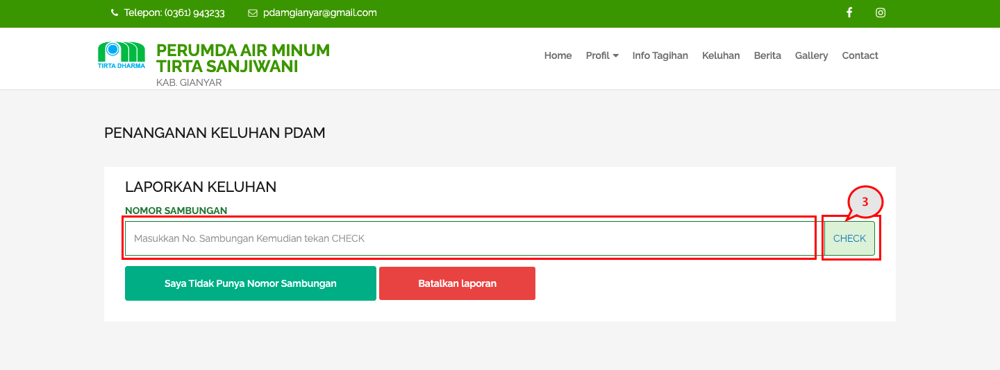
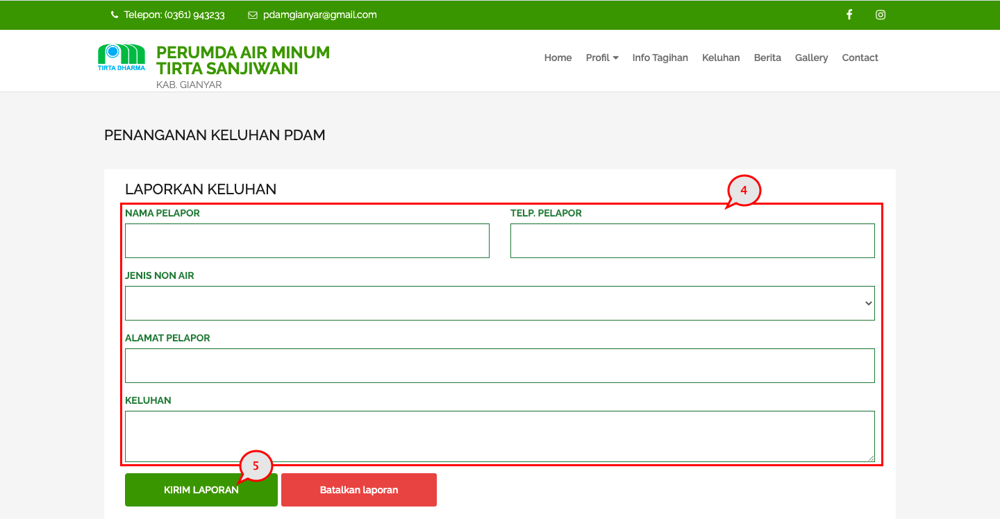
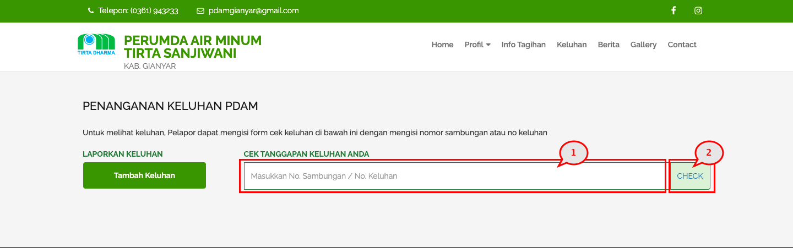

= Menyampaikan dan Memeriksa Keluhan

Dengan menu ini, pelanggan dapat menyampaikan keluhan baik teknis maupun administratif, serta memeriksa status keluhannya.

Untuk menambahkan keluhan, Anda dapat mengikuti langkah-langkah berikut:

1. Pilih menu *Keluhan*.
2. Pada bagian LAPORKAN KELUHAN, klik tombol *Tambah Keluhan*.
+

3. Masukkan *Nomor Sambungan*, kemudian klik tombol *CHECK*. Jika Anda tidak memiliki nomor sambungan, klik pada tombol *Saya Tidak Punya Nomor Sambungan*.
+

4. Isi _form_ yang tersedia.
5. Klik pada tombol *KIRIM LAPORAN*.

Setelah pengaduan terkirim, Anda dapat memeriksa statusnya dengan kembali pada halaman awal menu Keluhan, kemudian mengikuti langkah-langkah berikut:

1. Isi *nomor sambungan* atau *nomor tiket keluhan* pada _field_ *CEK TANGGAPAN KELUHAN ANDA*.
2. Klik pada tombol *CHECK*.
3. Sistem akan menampilkan status keluhan.
