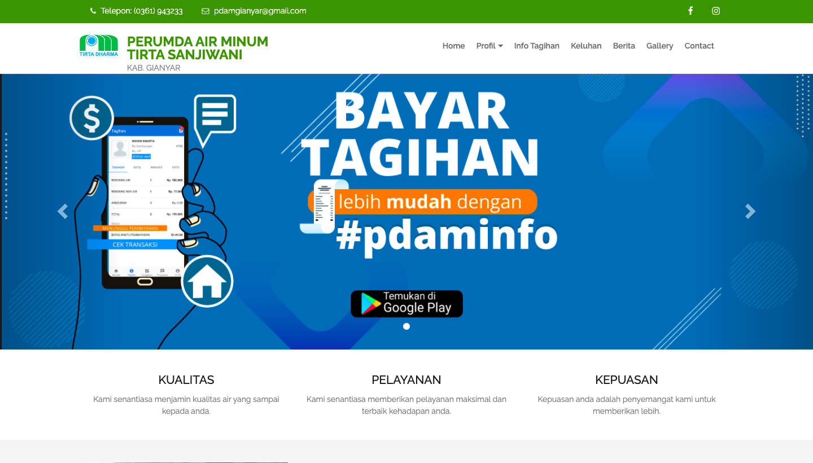

= Modul Info PDAM

Modul Info PDAM adalah aplikasi yang dikembangkan untuk pelanggan PDAM. Dalam aplikasi ini, pelanggan dapat memperoleh informasi tagihan rekening, history tagihan, keluhan pelanggan, informasi terkait PDAM, berita dan pengumuman pelanggan, serta informasi lainnya untuk pelanggan.

== Getting Started

link:./Getting-Started/Menu-Info-PDAM.adoc[Menu Info PDAM]

== Menu Info Tagihan

link:./Menu-Info-Tagihan/Memeriksa-Tagihan-Rekening.adoc[Memeriksa Tagihan Rekening]

== Menu Keluhan

link:./Menu-Keluhan/Menyampaikan-dan-Memeriksa-Keluhan.adoc[Menyampaikan dan Memeriksa Keluhan]

== Menu Berita

link:./Menu-Berita/Mengakses-Berita-Seputar-PDAM.adoc[Mengakses Berita Seputar PDAM]
