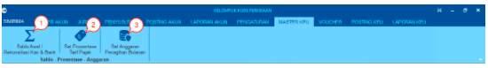
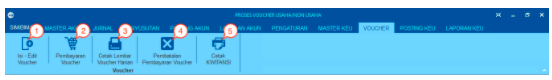
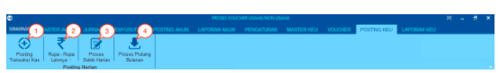
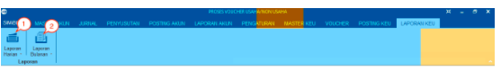

= Menu Modul Keuangan

Berikut adalah penjelasan masing-masing menu pada Modul Keuangan : 

== Menu Master Keuangan

1. Ikon *Saldo Awal/ Rekonsiliasi Kas & Bank* digunakan untuk mengelola informasi/data yang dimasukkan di saldo awal (dari menu Master Akun).

2. Ikon *Set Prosentase Tarif Pajak* digunakan untuk mengatur persentase tarif pajak.

3. Ikon *Set Anggaran Penagihan Bulanan* digunakan untuk mengatur anggaran yang dibuat untuk merencanakan penagihan bulanan sesuai dengan jenis anggaran dan wilayah.

== Menu Voucher

1. Ikon *Isi - Edit Voucher* digunakan untuk mengelola semua _voucher_ keuangan PDAM.

2. Ikon *Pembayaran Voucher* digunakan untuk mengatur pembayaran _voucher_.

3. Ikon *Cetak Lembar Voucher Harian* digunakan mencetak lembar _voucher_ harian.

4. Ikon *Pembatalan Pembayaran Voucher* digunakan untuk membatalkan pembayaran _voucher_ harian.

5. Ikon *Cetak KWITANSI* digunakan untuk mencetak kwitansi yang nanti diberikan kepada vendor agar dapat ditandatangani sebagai tanda terima.

== Menu Posting Keuangan

1. Ikon *Posting Transaksi Kas* digunakan untuk mengambil data penjualan air dari Modul Billing.

2. Ikon *Rupa Rupa Lainya* digunakan untuk memasukkan data penerimaan dan pengeluaran uang selain melalui loket atau _voucher_.

3. Ikon *Proses Saldo Harian* digunakan untuk input bukti setoran uang dari masing-masing loket ke bank yang bekerja sama dengan PDAM.

4. Ikon *Proses Piutang Bulanan* digunakan untuk memproses piutang air, piutang LC & LT, dan proses penerimaan bulanan.

== Menu Laporan Keuangan

1. Ikon *Laporan Harian* digunakan untuk mengatur dan mencetak laporan per hari.

2. Ikon *Laporan Bulanan* digunakan untuk mengatur dan mencetak laporan per bulan.