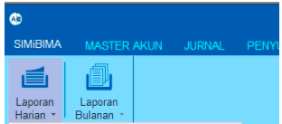
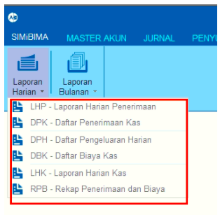
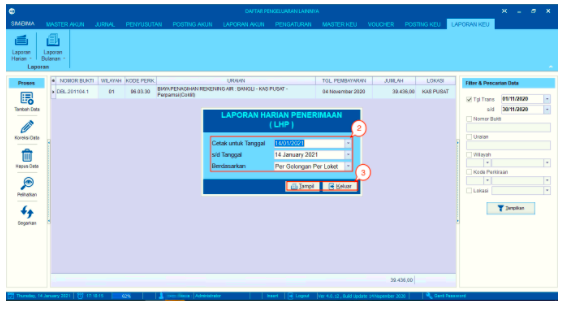
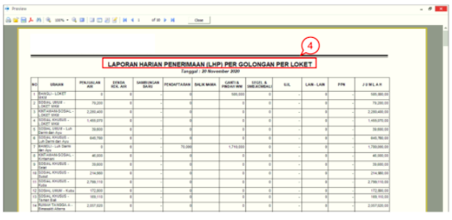
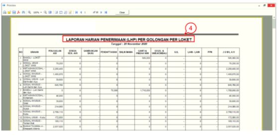
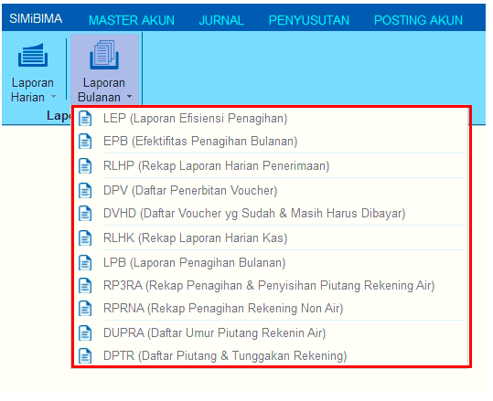
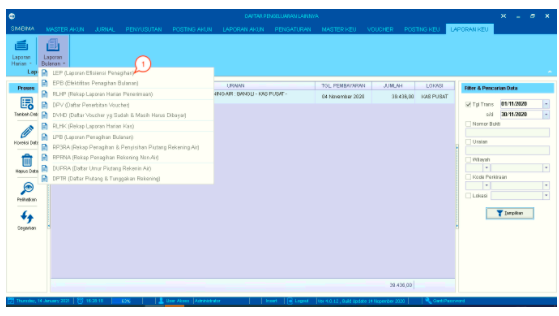
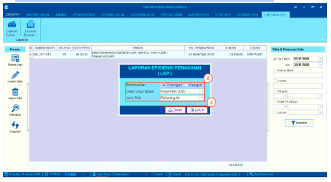
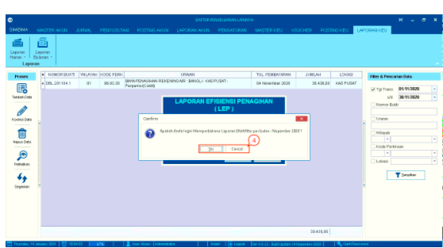
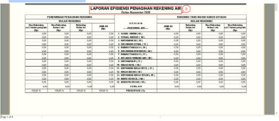

= Mengelola Laporan

Menu Laporan Keuangan digunakan untuk menampilkan berbagai laporan. Laporan tersebut mencakup berbagai proses yang dilakukan pada menu *Master Keuangan*, *Voucher*, dan *Posting Keuangan*. 
Menu Laporan mempunyai 2 fitur untuk menampilkan *Laporan Harian* dan *laporan Bulanan*

Berikut untuk langkah - langkah mengelola *Laporan Harian* dan *Laporan Bulanan* : 

.Mengelola Laporan Harian
[%collapsible]
====
Fitur Laporan Harian berfungsi untuk mengatur dan mencetak laporan per hari, yang mencakup enam (6) laporan, yaitu : 

1. LPH - Laporan Harian Penerimaan
2. DPK - Daftar Penerimaan Kas
3. DPH - Daftar Pengeluaran Harian
4. DBK - Daftar Biaya Kas
5. LHK - Laporan Harian Kas
6. RPB - Rekap Penerimaan dan Biaya

Laporan harian bisa ditampikan dengan memilih menu *Laporan* dan mengikuti langkah - langkah sebagai berikut :  

1. Klik ikon *Laporan Harian*, kemudian pilih *salah satu jenis laporan* sesuai kebutuhan. Sebagai contoh, dalam langkah ini akan dipilih *LHP - Laporan Harian Penerimaan*

+

2. Sistem akan menampilkan kotak dialog untuk filter laporan, tentukan opsi untuk masing-masing _field_ 

3. Setelah selesai, klik pada tombol *Tampil*

+

4. Gambar di atas ini merupakan contoh tampilan dari hasil Laporan Harian Penerimaan. Anda dapat melakukan klik pada ikon *Print* untuk mencetak laporan.

*Note:* Langkah-langkah di atas dapat digunakan untuk menampilkan semua jenis laporan sesuai dengan kebutuhan pada Fitur *Laporan Harian*
====

.Mengelola Laporan Bulanan
[%collapsible]
====
Fitur Laporan Harian berfungsi untuk mengatur dan mencetak laporan per bulan, yang mencakup sebelas (11) laporan, yaitu : 

1. Laporan Efisiensi Penagihan ( LEP )

2. Efektivitas Penagihan Bulanan ( EPB )

3. Rekap Laporan Harian Penerimaan (RLHP)

4. Daftar Penerbitan Voucher ( DPV )

5. Daftar Voucher YSM Harus Dibayar ( DVHD )

6. Rekap Laporan Harian Kas ( RLHK )

7. Laporan Penagihan Bulanan ( LPB )

8. Rekap Penagihan & Penyisihan Piutang Rekening Air ( RP3RA )

9. Rekap Penagihan Non Air ( RPNA )

10. Daftar Umur Piutang Rekening Air ( DUPRA )

11. Daftar Piutang & Tunggakan Rekening ( DPTR )

Laporan bulanan bisa ditampikan dengan memilih menu *Laporan* dan mengikuti langkah - langkah sebagai berikut : 

1. Klik ikon *Laporan Bulanan*, kemudian pilih *salah satu jenis laporan* sesuai kebutuhan. Sebagai contoh, dalam langkah ini akan dipilih *LEP - Laporan Efisiensi Penagihan*

+

2. Sistem akan menampilkan kotak dialog untuk filter laporan, tentukan opsi untuk masing-masing _field_

3. Setelah selesai, klik pada tombol *Tampil*

+

4. Setelah itu, akan muncul pop-up konfirmasi. Klik tombol *Yes* untuk menampilkan laporan

+

5. Gambar di atas ini merupakan contoh tampilan dari hasil laporan Laporan Efisiensi Penagihan. Anda dapat melakukan klik pada ikon *Print* untuk mencetak laporan.

*Note:* Langkah-langkah di atas dapat digunakan untuk menampilkan semua jenis laporan sesuai dengan kebutuhan pada Fitur *Laporan Bulanan*
====