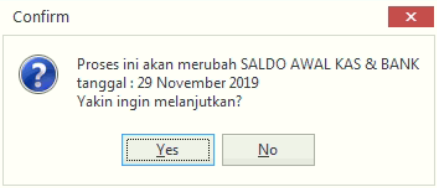

= Memasukkan Data Saldo Awal atau Rekonsiliasi Kas dan Bank

Fitur ini mengelola informasi/data yang dimasukkan di saldo awal (dari menu Master Akun). Dalam menu ini terjadi proses penyesuaian semua transaksi penyetoran kas dan bank selama periode tertentu. Untuk melakukan rekonsiliasi, ikuti langkah-langkah berikut:

1. Pilih menu *Master Keu*

2. Klik ikon *Saldo Awal/Rekonsiliasi Kas & Bank* 

3. Akan muncul form pengisian data *Rekonsiliasi Kas & Bank*. Selanjutnya pilih *Tanggal Rekonsiliasi*, *Saldo Awal di KAS* pada masing-masing bank yang tertera pada form. 

4. Setelah input data saldo sesuai, klik tombol *Proses* untuk lanjut ke proses berikutnya. Namun, jika ingin membatalkan penyesuaian saldo, klik tombol *Batal*
+

5. Setelah menekan tombol *Proses* akan muncul kotak dialog konfirmasi penyesuaian. Lalu, klik tombol *Yes* untuk menyimpan.

