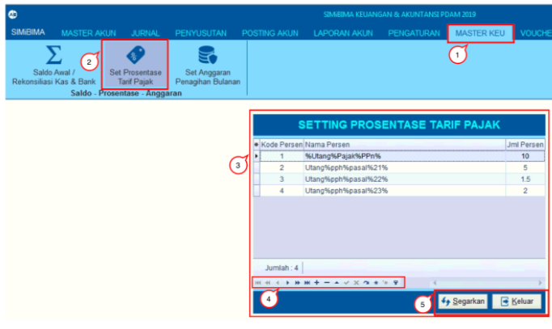

= Menambah dan Memperbarui Presentase Tarif Pajak

Fitur ini berfungsi untuk mengatur persentase tarif pajak. Pengaturan ini dipakai pada _voucher_, sehingga otomatis _voucher_ yang dibuat terpotong pajak sesuai kode presentase yang dimasukkan (lihat gambar di bawah ini). Untuk menambah atau memperbarui persentase tarif pajak, ikuti langkah-langkah berikut:

1. Pilih menu *Master Keu*

2. Klik ikon *Set Prosentase Tarif Pajak*

3. Selanjutnya akan muncul _form_ *Setting Persentase Tarif Pajak*. Pada _form_ ini ditampilkan daftar tabel persentase tarif pajak dari masing-masing jenis pajaknya

4. Tombol-tombol yang ada di kotak merah berfungsi untuk menambah, menghapus, dan memperbarui nama dan jumlah persen

5. Jika sudah, Anda dapat menekan tombol *Segarkan* (_refresh_ data) untuk memperbarui _setting_ persentase tarif pajak. Namun, jika ingin membatalkan perubahan yang dilakukan, klik tombol *Keluar*.

