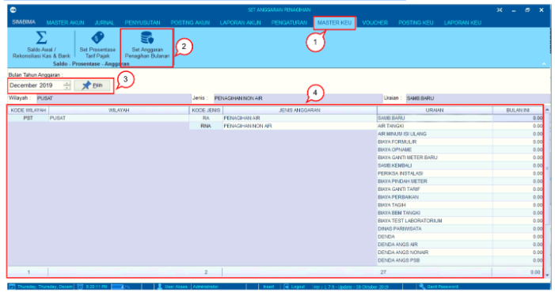
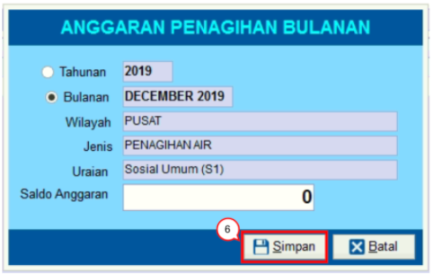
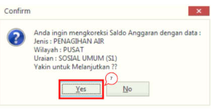

= Mengatur Anggaran Penagihan Bulanan

Fitur ini berfungsi untuk mengatur anggaran yang dibuat untuk merencanakan penagihan bulanan sesuai dengan jenis anggaran dan wilayah. Untuk mengatur anggaran penagihan bulanan, ikuti langkah-langkah berikut:

1. Pilih menu *Master Keu*

2. Klik ikon  *Set Anggaran Penagihan Bulanan*

3. Tentukan *Bulan* dan *Tahun Anggaran* yang ingin dilihat atau diperbarui. Setelah memilih bulan dan tahun, klik tombol *Pilih* dengan ikon sesuai dengan nomor 3. 

4. Selanjutnya akan muncul tabel berisi informasi *Kode Wilayah, Nama Wilayah, Kode Jenis Anggaran, Jenis Anggaran, Uraian,* dan *Anggaran Bulanan* akan muncul di laman
+

5. *Klik kanan* pada salah satu data yang ingin dilihat di tabel. Setelah itu, muncul kotak dialog *Anggaran Penagihan Bulanan*. Masukkan informasi yang ingin ditambahkan

6. Kemudian klik *Simpan* untuk menyimpan data
+

7. Setelah menekan tombol *Simpan*, akan muncul kotak dialog konfirmasi koreksi data yang baru saja dilakukan. Klik *Yes*, jika sudah yakin.

