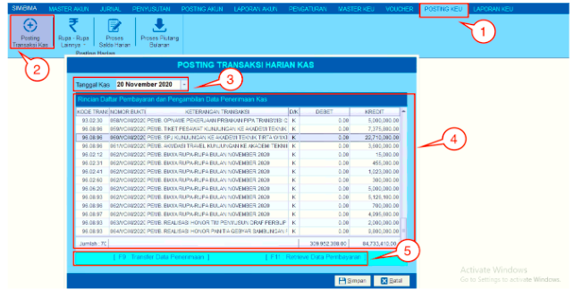
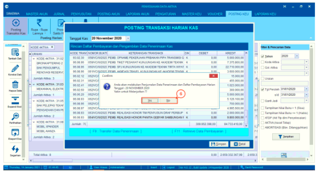

= Memposting Transaksi Harian Kas

Fitur ini berfungsi untuk mengambil data penjualan air harian dari aplikasi Billing. Untuk melakukan posting transaksi kas, ikuti langkah-langkah berikut:

1. Pilih menu *Posting Keu*

2. Klik ikon *Posting Transaksi Kas*

3. Akan muncul kotak dialog *Posting Transaksi Harian Kas*. Selanjutnya pilih tanggal kas yang ingin dilihat data penerimaannya

4. Rincian data tersedia sesuai dengan tanggal kas yang ditentukan

5. Untuk _shortcut_-nya, Anda dapat menekan *F9* untuk transfer data penerimaan, sedangkan *F11* untuk mengambil data pengambilan _voucher_.  Jika sudah, klik tombol *Simpan*

+

6. Setelah disimpan akan muncul kotak dialog konfirmasi penjurnalan data penerimaan dan daftar pembayaran harian sesuai tanggal yang dipilih. Jika Anda yakin untuk melanjutkan, klik tombol *Yes*.
