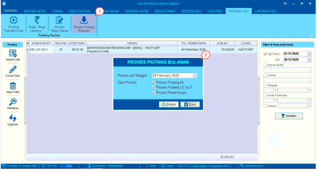
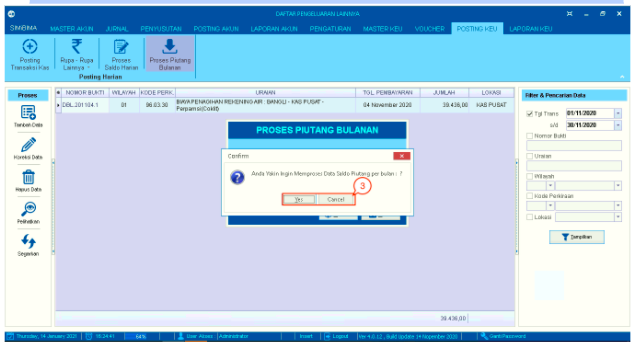

= Memproses Piutang Bulanan Air, LC & LT, dan Penerimaan Bulanan

Fitur ini berfungsi untuk memproses piutang air, piutang LC & LT, dan proses penerimaan bulanan. Proses ini dilakukan tiap awal bulan setelah terbitnya DRD (Daftar Rekening Ditagih). Untuk melihat proses piutang, Anda dapat mengikuti langkah-langkah berikut:

1. Klik ikon *Proses Piutang Bulanan*

2. Tentukan *Proses s/d Tanggal dan Opsi Proses*, kemudian klik tombol *Proses*

+

3. Setelah itu akan muncul kotak dialog konfirmasi data saldo piutang per bulan. Untuk melanjutkan proses, klik tombol *Yes*
