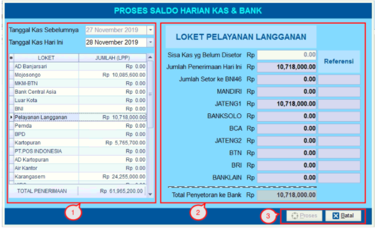

= Memproses Saldo Harian Kas dan Bank

Fitur ini digunakan untuk input bukti setoran-setoran uang dari masing-masing loket ke bank yang bekerja sama dengan PDAM. Anda dapat mengikuti langkah-langkah berikut:

1. Klik ikon *Proses Saldo Harian Kas & Bank*

2. Sistem akan menampilkan kotak dialog *Proses Saldo Harian Kas & Bank*. Selanjutnya, Anda dapat mengisi form dengan data setoran dari bank 

3. Masukkan jumlah setoran sesuai kolom bank masing-masing kemudian klik tombol *Proses*.
