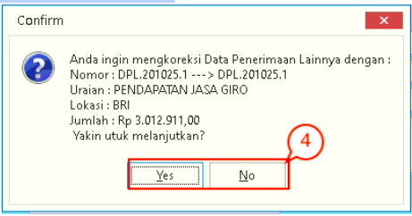

= Mengelola Data Penerimaan Lainnya

Menu ini mengatur dan memasukkan data penerimaan uang masuk ke PDAM tanpa melalui loket, seperti penerimaan pendapatan jasa giro. Untuk *menambah, mengoreksi, menghapus atau melihat data*, ikuti langkah-langkah berikut:

Keterangan gambar:

1. Sub menu *Rupa-Rupa Lainnya*

2. Sidebar yang berisi pilihan fitur *Tambah, Koreksi Data, Hapus Data, Perlihatkan*, dan *Segarkan*

3. Tabel yang berisi data penerimaan lainnya

4. Fitur *Filter & Pencarian Data*

== Proses Tambah Data

1. Klik ikon *Rupa-Rupa Lainnya* dan pilih sub ikon *Penerimaan Lainnya*. Pilih ikon *Tambah Data* yang ada pada sidebar sebelah kiri

2. Setelah itu, akan muncul kotak dialog *Tambah - Data Penerimaan Lainnya (DPL)*. Lengkapi _form_ *Tambah - Data Penerimaan Lainnya (DPL)* seperti *Tanggal DPL*, Nomor DPL*, *Kategori*, *Wilayah*, *Bank*, *Uraian**, Penjelasan*, dan *Jumlah DPL*. 

3. Setelah selesai, klik tombol *Simpan*

+

4. Akan muncul kotak dialog konfirmasi data penerimaan lainnya. Untuk melanjutkan proses, klik  tombol *Yes*.

== Proses Koreksi Data

1. Klik ikon *Rupa-Rupa Lainnya* dan pilih *Penerimaan Lainnya*. Pilih ikon *Koreksi Data* yang ada pada sidebar sebelah kiri

2. Setelah itu, akan muncul kotak dialog *Tambah - Data Penerimaan Lainnya (DPL)*. Lengkapi _form_ *Tambah - Data Penerimaan Lainnya (DPL)* seperti *Tanggal DPL*, *Nomor DPL*, *Kategori*, *Wilayah*, *Bank*, *Uraian*, *Penjelasan*, dan *Jumlah DPL*.

3. Setelah selesai, klik tombol *Simpan*

+

4. Akan muncul kotak dialog konfirmasi data penerimaan lainnya. Untuk melanjutkan proses, klik  tombol *Yes*.

== Proses Hapus Data

1. Pilih data di dalam tabel yang ingin dihapus, lalu klik ikon *Hapus Data* yang ada di sidebar proses sebelah kiri

2. Akan muncul kotak dialog seperti gambar. Jika Anda yakin untuk menghapus data, klik  tombol *Yes*. Jika tidak, klik tombol *No*.

== Proses Preview Data

1. Pilih ikon *Perlihatkan* pada sidebar sebelah kiri
+

2. Sistem akan menampilkan _preview_ Data Penerimaan Lainnya (DPL)
