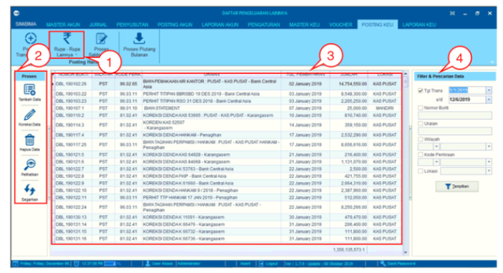
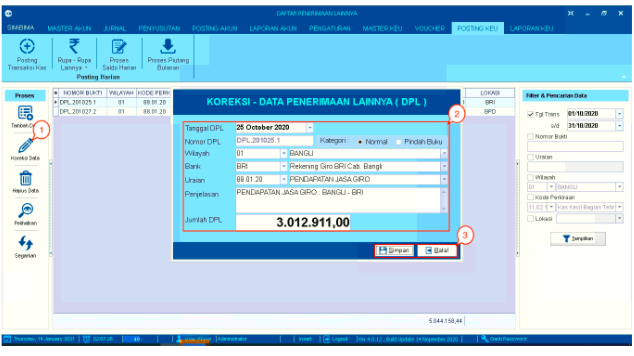
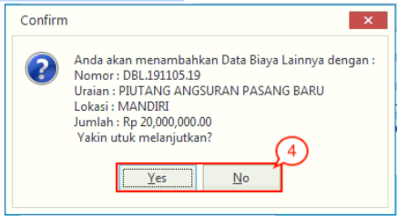
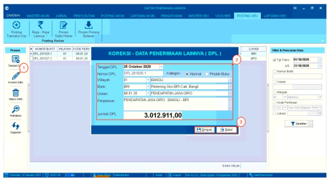
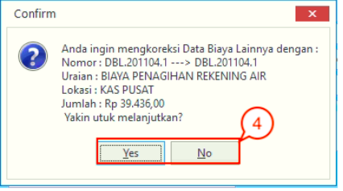
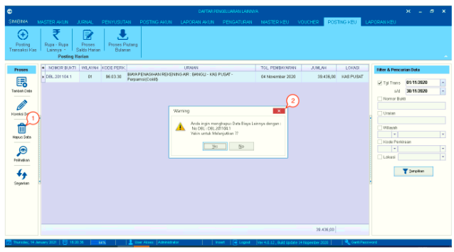
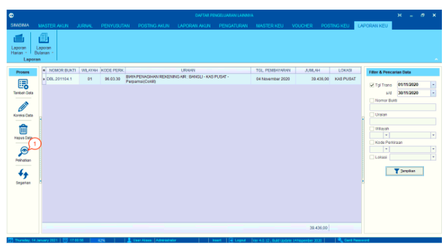
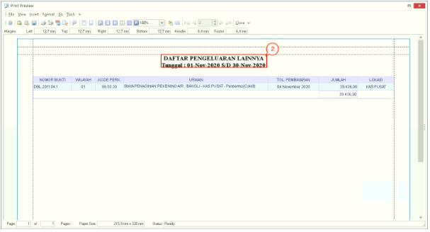

= Mengelola Data Pengeluaran Lainnya

Menu ini mengatur dan memasukkan semua pengeluaran di PDAM tanpa melalui _voucher_, seperti biaya admin bank. Untuk *menambah, mengoreksi, menghapus atau melihat data*, berikut langkah-langkahnya:

Keterangan gambar:

1. Sub menu *Rupa-Rupa Lainnya*

2. 2. Sidebar yang berisi pilihan fitur *Tambah*, *Koreksi Data*, *Hapus Data*, *Perlihatkan*, dan *Segarkan*

3. Tabel yang berisi data penerimaan lainnya

4. Fitur *Filter & Pencarian Data*

== Proses Tambah Data

1. Pilih ikon *Tambah Data* pada sidebar proses di sebelah kiri layar

2. Setelah itu, akan muncul kotak dialog *Tambah - Data Biaya Lainnya (DBL)*. Lengkapi _form_ *Tambah - Data Biaya Lainnya (DBL)* seperti *Tanggal DBL*, *Nomor DBL*, *Kategori*, *Wilayah*, *Bank*, *Uraian*, *Penjelasan*, dan *Jumlah DBL*. 

3. Setelah selesai, klik tombol *Simpan*

+

4. Akan muncul kotak dialog konfirmasi data biaya lainnya. Jika Anda sudah yakin untuk menambahkan data, klik  tombol *Yes*. Jika tidak, klik tombol *No*.

== Proses Koreksi Data

1. Pilih ikon *Koreksi Data* pada sidebar proses di sebelah kiri layar 

2. Setelah itu, akan muncul kotak dialog *Tambah - Data Biaya Lainnya (DBL)*. Lengkapi _form_ *Tambah - Data Biaya Lainnya (DBL)* seperti *Tanggal DBL*, *Nomor DBL*, *Kategori*, *Wilayah*, *Bank*, *Uraian*, *Penjelasan*, dan *Jumlah DBL*. 

3. Setelah selesai, klik tombol *Simpan*

+

4. Akan muncul kotak dialog konfirmasi koreksi data penerimaan lainnya. Untuk melanjutkan proses koreksi, klik  tombol *Yes*. Untuk membatalkan proses, klik tombol *No* 

== Proses Hapus Data

1. Pilih data di dalam tabel yang ingin dihapus, lalu klik ikon *Hapus Data* pada sidebar proses di sebelah kiri layar

2. Selanjutnya akan muncul _pop-up warning_ seperti gambar di atas. Klik pada tombol *Yes* untuk menghapus data. Klik pada tombol *No* untuk membatalkannya.
== Proses Preview

1. Pilih ikon *Perlihatkan* yang ada di sidebar sebelah kiri

+

Sistem akan menampilkan _preview_  *Data Pengeluaran Lainnya (DPL)*

