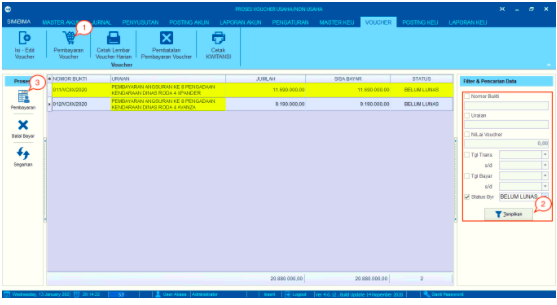
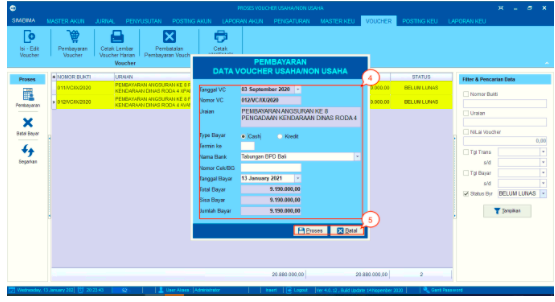
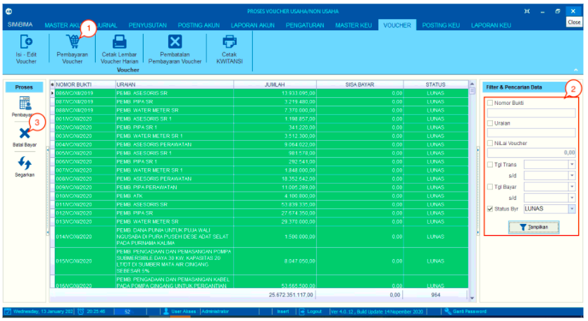
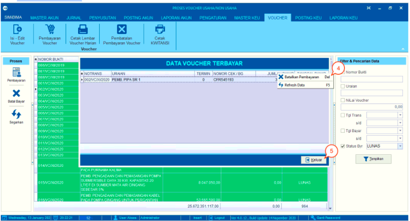
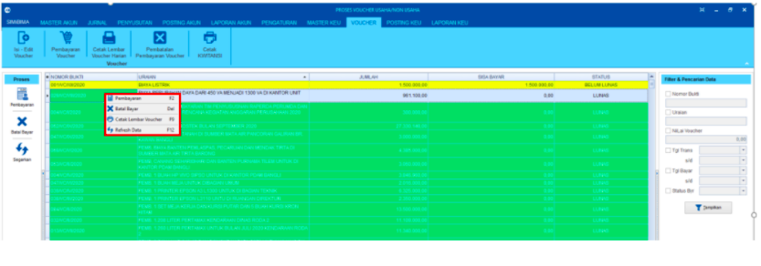

= Memproses dan Membatalkan Pembayaran Voucher

Fitur ini berfungsi untuk mengatur pembayaran voucher. Berikut langkah-langkahnya:

== Proses Pembayaran Voucher

1. Klik pada *Pembayaran Voucher*

2. Pilih _value_ *belum lunas* pada filter, kemudian klik tombol *Tampilkan*

3. Pilih data _voucher_ yang ada ada di tampilan tabel data dan Klik  fitur *Pembayaran* untuk memberikan detail keterangan pembayaran _voucher_ yang akan dilakukan oleh PDAM
+

4. Setelah muncul kotak detail *Pembayaran Data Voucher Usaha/Non Usaha*, pastikan kembali data yang diinput telah benar

5. Klik ikon *Proses* untuk melanjutkan proses pembayaran voucher. 

== Proses Batal Bayar Voucher

1. Klik pada *Pembayaran Voucher*

2. Pilih _value_ lunas pada filter, kemudian klik tombol *Tampilkan*

3. Pilih data voucher yang akan dibatalkan, kemudian klik tombol  *Batal Bayar* 

+

4. Setelah itu muncul kotak *Data Voucher Terbayar*, klik kanan di kolom tabel *Jumlah*. Pilih *Batalkan Pembayaran*

5. Jika sudah selesai, klik pada tombol *Keluar*.

== Klik Kanan Action

Pada menu pembayaran, terdapat fitur klik kanan yang mempunyai beberapa fungsi, yaitu : 

- *Pembayaran* : digunakan untuk melakukan pembayaran terhadap data _voucher_ yang dipilih.

- *Batal Bayar* : digunakan untuk melakukan pembatalan pembayaran terhadap data _voucher_ yang dipilih.

- *Cetak Lembar Voucher* : digunakan untuk melakukan cetak _voucher_ sesuai dengan data yang dipilih.

- *Refresh Data* : digunakan untuk melakukan _refresh_ terhadap daftar data.
