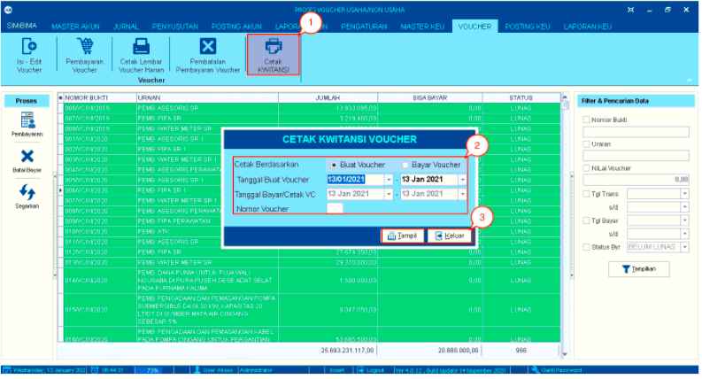
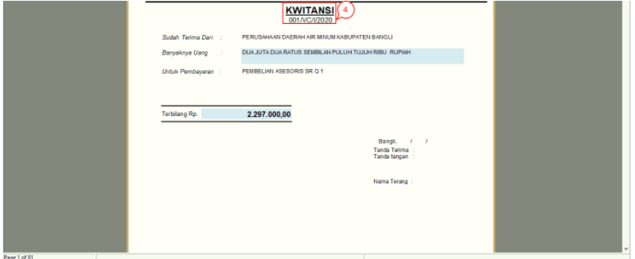

= Mencetak Kwitansi Pembelian Voucher

Fitur ini berfungsi untuk mencetak Kwitansi yang akan diberikan kepada vendor untuk ditandatangani sebagai tanda terima.  Berikut langkah-langkahnya:

1. Klik ikon *Cetak Kwitansi* hingga muncul kotak dialog Cetak *Kwitansi Voucher*

2. Pada _form_ *Cetak Kwitansi Voucher*, lengkapi _field_ *Cetak Berdasarkan*, *Tanggal Buat Voucher*, *Tanggal Bayar/Cetak VC*, dan *Nomor Voucher* sesuai dengan data kwitansi _voucher_ yang ingin dicetak

3. Setelah selesai, klik tombol *Tampil* untuk lanjut ke proses berikutnya. Jika Anda ingin membatalkan perintah cetak, klik tombol *Keluar*

+

4. Selanjutnya akan muncul *preview file*. Anda dapat mencetak kwitansi dengan menekan ikon *Print* .