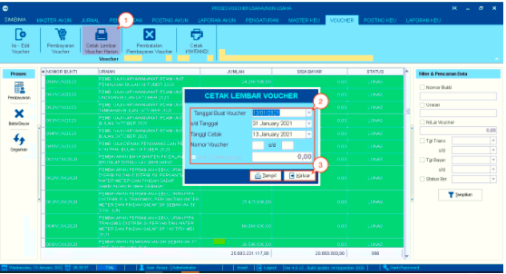
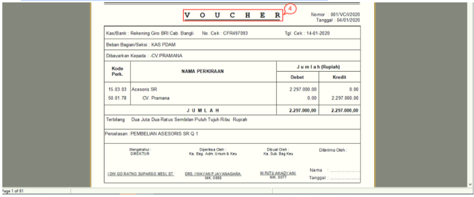

= Mencetak Lembar Voucher Harian

Fitur ini berfungsi untuk mencetak lembar _voucher_ harian. Berikut langkah-langkahnya:

1. Pilih ikon *Cetak Lembar Voucher Harian*, kemudian klik salah satu data di kolom di tabel. Selanjutnya, klik ikon *Cetak Lembar Voucher Harian*

2. Setelah muncul kotak *Cetak Lembar Voucher*, lengkapi data dengan *Tanggal Buat Voucher s/d Tanggal*, *Tanggal Cetak*, dan *Nomor Voucher* sesuai dengan data yang ingin dicetak

3. Setelah selesai, klik tombol *Tampil* untuk lanjut ke proses berikutnya. Jika Anda ingin membatalkan perintah cetak, klik tombol *Keluar*

+

4. Selanjutnya akan muncul _preview file_. Anda dapat mencetak _voucher_ dengan menekan ikon *Print* .
