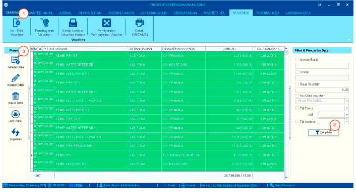
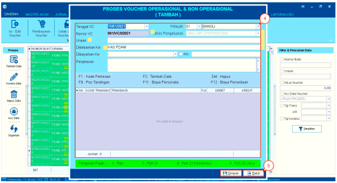
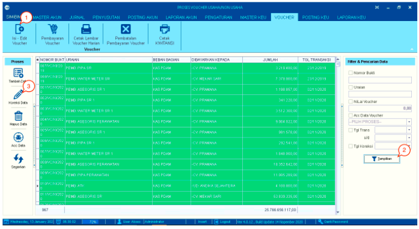
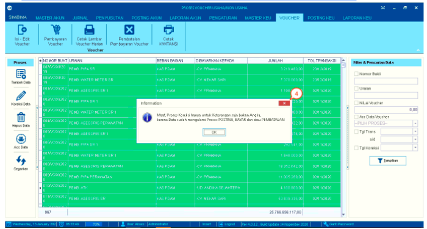
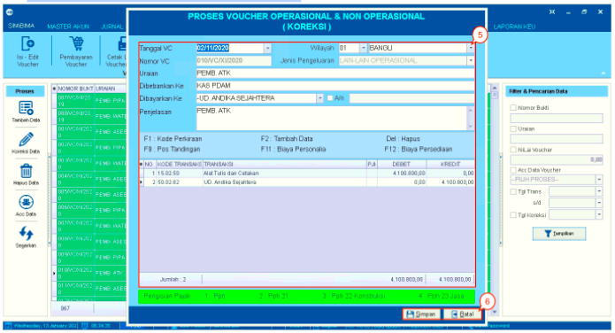
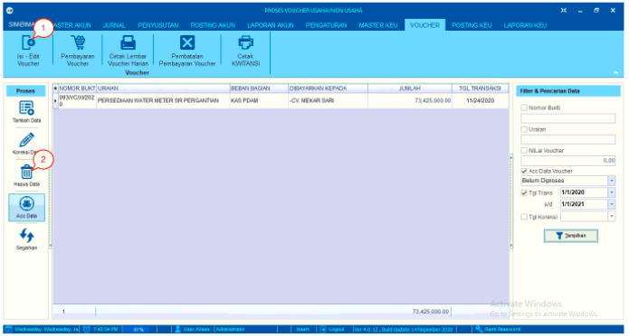
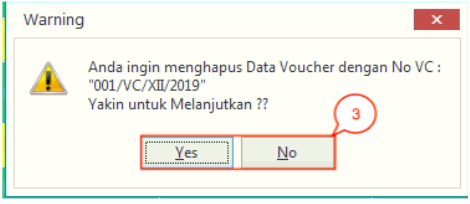
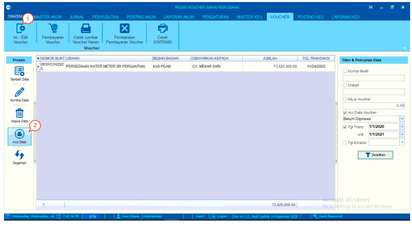
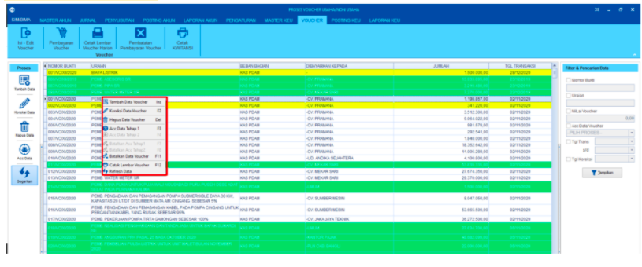

= Mengelola Data Voucher

Fitur ini berfungsi untuk mengisi dan mengedit data voucher. Baik itu menambah, mengoreksi, menghapus, menyetujui data dan menyegarkan laman (_refresh page_).  Berikut langkah-langkahnya:

== Cara Menambah Data

1. Klik pada *Isi - Edit Voucher*

2. Isi _value_ pada filter dan klik tombol *Tampilkan* untuk menampilkan data pada tabel

3. Klik tombol *Tambah Data* untuk memunculkan kotak dialog untuk menambah data
+

4. Masukan data permohonan _voucher_ dan berikan uraian dan penjelasan

5. Klik tombol *Simpan* untuk menyimpan data

== Cara Mengoreksi Data

1. Klik pada *Isi - Edit Voucher*

2. Isi _value_ pada filter, kemudian klik tombol *Tampilkan* untuk menampilkan data pada tabel

3. Pilih data pada tabel yang ingin diperbaharui, kemudian klik tombol *Koreksi Data* hingga muncul kotak dialog untuk proses koreksi _voucher_

+

4. Klik tombol *OK* ketika _pop-up_ muncul

+

5. Masukan data _voucher_ yang ingin diperbarui secara lengkap

6. Klik tombol *Simpan*.

== Cara Menghapus Data

1. Klik pada *Isi - Edit Voucher*

2. Pilih data pada tabel yang ingin dihapus, kemudian klik pada ikon *Hapus Data*

+

3. Sistem akan menampilkan kotak dialog untuk mengkonfirmasi penghapusan data. Klik *Yes* untuk melanjutkan.

== Cara Menyetujui Data

1. Klik pada *Isi - Edit Voucher*

2. Pilih data pada tabel yang berwarna coklat. Warna tersebut menandakan bahwa data belum disetujui

3. Klik pada tombol *Acc Data*.

== Klik Kanan Action

Pada menu *edit voucher*, terdapat juga _action_ klik kanan yang mempunyai beberapa fungsi, yaitu :

- *Tambah Data Voucher* : untuk menambah data _voucher_ baru.

- *Koreksi Data Voucher* : untuk mengoreksi data _voucher_ sesuai dengan data yang dipilih.

- *Hapus Data Voucher* : untuk menghapus data _voucher_ sesuai dengan data yang dipilih.

- *Acc Tahap 1 dan Acc Tahap 2* : untuk melakukan Acc terhadap data _voucher_ yang dipilih.

- *Batalkan Acc Tahap 1 dan Acc Tahap 2* : untuk melakukan pembatalan Acc 1 dan 2 terhadap data _voucher_ yang dipilih.

- *Batalkan Data Voucher* : untuk membatalkan data _voucher_ yang sudah ada sesuai dengan data yang dipilih

- *Cetak Lembar Voucher* : untuk mencetak _voucher_ sesuai dengan data yang dipilih

- *Refresh Data* : untuk melakukan refresh terhadap daftar data _voucher_