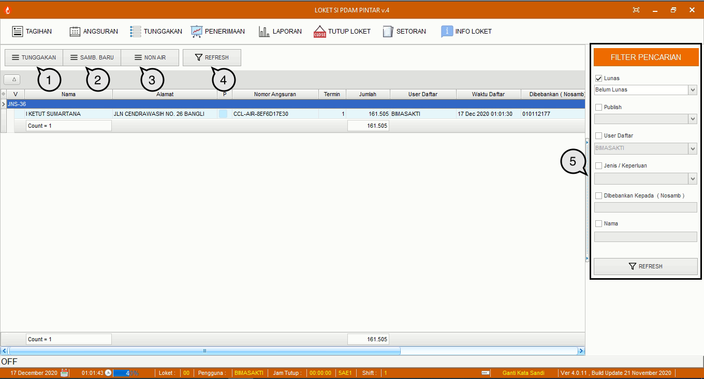

= Menu Modul Loket

Terdapat 8 menu dalam Modul Loket, yaitu:

1. Menu Tagihan
+
.Detail Menu Tagihan
[%collapsible]
====

Menu *Tagihan* digunakan untuk melihat tagihan masing-masing pelanggan baik rekening air maupun non air juga melakukan pembayaran. Pembayaran dapat dilakukan secara satuan maupun kolektif. Gambar di atas merupakan layar yang menampilkan tagihan individual (satuan). Di sisi kiri layar, Anda dapat melihat detail info pelanggan (mencakup nama, alamat, detail rekening air, area, hingga rayon) dan detail info tagihan. Di tengah layar, Anda dapat melihat rangkuman tagihan tersebut. Selain itu di kanan dan bawah layar juga terdapat beberapa ikon yang dapat digunakan dengan fungsi sebagai berikut:

1. Ikon *Pelanggan* menyediakan fasilitas untuk memberikan informasi tagihan sekaligus melakukan pembayaran air pelanggan.
2. Ikon *Kolektif* menyediakan fasilitas untuk memberikan informasi tagihan sekaligus melakukan pembayaran kolektif pelanggan.
3. Ikon *Non Pelanggan* menyediakan fasilitas untuk memberikan informasi tagihan sekaligus melakukan pembayaran non air pelanggan.
4. Ikon *Bayar* menyediakan fasilitas untuk memproses pembayaran tagihan pelanggan.
5. Ikon *Histori* menyediakan fasilitas untuk melakukan pencatatan aktivitas pembayaran tagihan pelanggan air dan non-air. Fitur ini nantinya akan dilengkapi oleh fitur pembatalan transaksi dan cetak ulang kwitansi seluruh pembayaran pelanggan air dan non-air.
6. Ikon *Cetak* menyediakan fasilitas untuk mencetak rincian tagihan yang harus dibayar oleh pelanggan.
7. Ikon *Manual / Cetak Manual* menyediakan fasilitas untuk mencetak kwitansi rekening air yang harus dibayar oleh pelanggan air dan non-air dengan atau tanpa pelunasan terlebih dahulu. Pada menu ini akan ditampilkan rincian tagihan pelanggan pada aplikasi.
8. Ikon *Hapus Semua Centang* menyediakan fasilitas untuk menghapus centang pada rincian tagihan.
====
2. Menu Angsuran
+
.Detail Menu Angsuran
[%collapsible]
====

Menu *Angsuran* digunakan untuk membuat angsuran pembayaran untuk masing-masing pelanggan. Berikut adalah fitur yang dapat digunakan dalam menu berikut:

1. Ikon *Tunggakan* menyediakan fasilitas untuk membuat angsuran dengan kategori air
2. Ikon *Sambungan Baru* menyediakan fasilitas untuk membuat angsuran dengan kategori sambungan baru
3. Ikon *Non Air* menyediakan fasilitas untuk membuat angsuran dengan kategori non air
4. Ikon *Refresh* menyediakan fasilitas untuk memuat kembali halaman / data yang gagal dimuat sebelumnya.
Sidebar Filter Pencarian berfungsi mencari angsuran pelanggan dengan kategori yang lebih spesifik
====
3. Menu Tunggakan
+
.Detail Menu Tunggakan
[%collapsible]
====

Menu *Tunggakan* berfungsi untuk menampilkan seluruh data informasi tunggakan tagihan air pelanggan berdasarkan kategori yang dibutuhkan. Hasilnya akan ditampilkan dalam bentuk cetak laporan, dan selanjutnya akan digunakan oleh petugas PDAM untuk menagih tunggakan air kepada pelanggan.
====
4. Menu Penerimaan
+
.Detail Menu Penerimaan
[%collapsible]
====

Menu *Penerimaan* berfungsi untuk menampilkan data pelunasan yang dilakukan oleh pelanggan. Data yang ditampilkan adalah pelunasan harian.
====
5. Menu Laporan
+
.Detail Menu Laporan
[%collapsible]
====

Menu *Laporan* berfungsi untuk menyediakan fasilitas mencetak laporan berdasarkan kategori.  Laporan yang ditampilkan mencakup 4 kategori, yaitu Daftar Penerimaan, Tunggakan, dan Lainnya.
====
6. Menu Tutup Loket
+
.Detail Menu Tutup Loket
[%collapsible]
====

Menu ini digunakan untuk menghentikan proses pembayaran pada loket ketika jam operasional PDAM telah berakhir dan menutup proses transaksi per harinya. Jika terdapat pelanggan yang melakukan pembayaran diluar jam operasional maka transaksi akan masuk pada tanggal / hari berikutnya. Hal ini dilakukan agar tidak terganggunya data jumlah dan total penerimaan harian oleh transaksi susulan.  Berikut adalah tampilan halaman dari menu *Tutup Loket*. Seperti yang bisa Anda lihat, ada 2 informasi yang harus diisi, yaitu Penerimaan Loket D dan Uang Kecil. Tekan tombol *Simpan* untuk menyimpan informasi yang telah ditulis dan melanjutkan proses, atau tekan tombol *Batal* untuk membatalkan proses.
====
7. Menu Setoran
+
.Detail Menu Setoran
[%collapsible]
====

Menu *Setoran* berfungsi untuk melakukan input slip setoran dari bank baik berupa nominal dan keterangan yang tertera pada akhir lampiran setelah nominal setoran diinputkan, sehingga dapat diketahui apakah uang yang disetorkan ke bank sudah sesuai dengan penerimaan di loket.
====
8. Menu Info Loket
+
.Detail Menu Info Loket
[%collapsible]
====

Menu *Info Loket* berfungsi untuk menampilkan detail jumlah tagihan yang akan ditampilkan pada second layar untuk ditampilkan kepada pelanggan di loket kasir.
====
