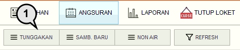
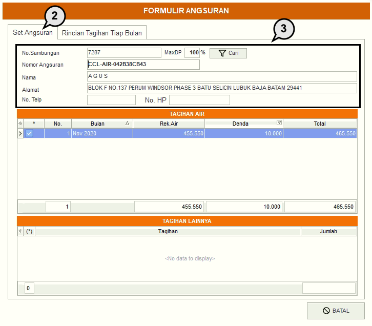
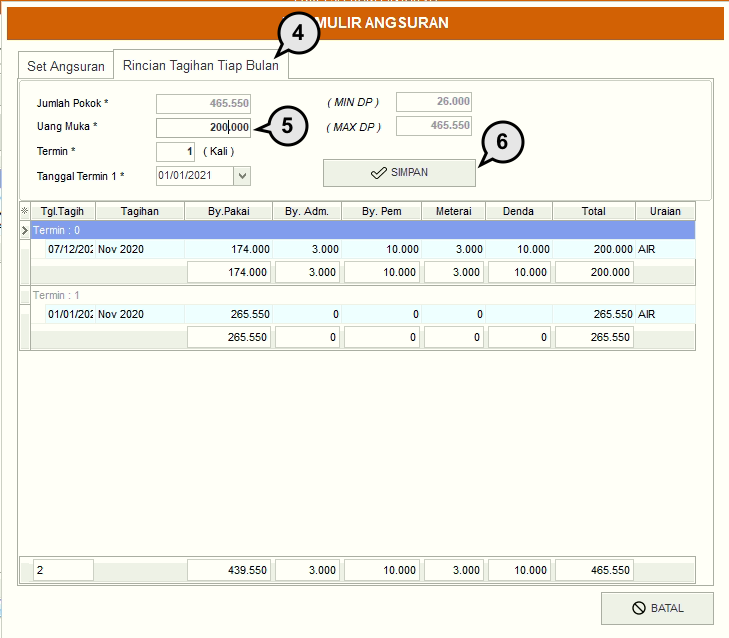

= Membuat Angsuran Air

Untuk membuat angsuran air, silakan mengikuti langkah-langkah di bawah ini:

1. Pada menu *Angsuran*, pilih ikon *Tunggakan* untuk menampilkan detail pembuatan angsuran air.
+

2. Pilih kolom *Set Angsuran*.
3. Masukkan detail data pelanggan yang ingin dicari seperti  *Nomor Sambungan*, *Nomor Angsuran*, *Nama*, *Alamat*, *No.Telp* atau *No. HP*. selanjutnya klik pada tombol *Cari*. Jika nomor sambungan yang Anda masukkan benar, maka data tagihan pelanggan secara otomatis akan muncul.
+

4. Pilih kolom *Rincian Tagihan Tiap Bulan*.
5. Masukkan jumlah *Uang Muka* (nominal uang muka didapatkan dari biaya administrasi, pemeliharaan, dan materai), *Termin / Cicilan*, dan *Tanggal Termin*. 
6. Jika semua data sudah dimasukkan, untuk proses akhir, tekan tombol *Simpan* untuk memproses pembuatan angsuran air.
