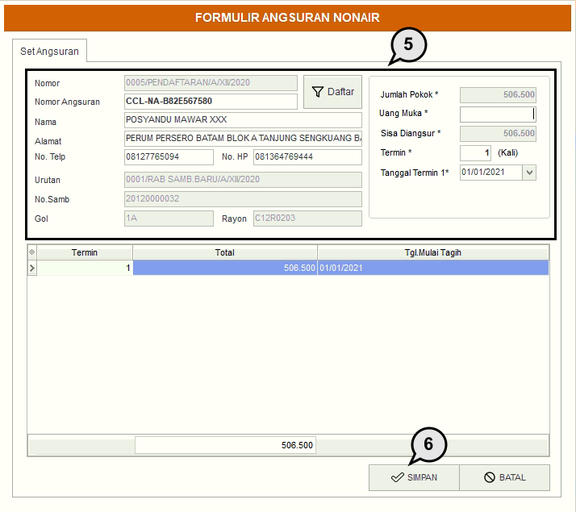

= Membuat Angsuran Non Air

Untuk membuat angsuran non air, silakan mengikuti langkah-langkah di bawah ini:

1. Pada menu *Angsuran* pilih ikon Non Air untuk menampilkan detail pembuatan angsuran non air baru
+

2. Gunakan tombol *Daftar* untuk melihat data pelanggan yang sudah terdaftar
+

3. Masukkan detail data pelanggan yang ingin dicari seperti *Nama Pelanggan*, *Tahun Input*, dan Alamat.
4. Gunakan tombol *Cari* untuk mencari data calon pelanggan. Jika sudah klik kiri pada mouse sebanyak 2x pada data pelanggan yang ingin diproses.
+

5. Masukan data pelanggan, seperti *No Telepon*, *Tanggal Termin*, *Uang Muka*, *Jumlah Termin*, dan seterusnya.
6. Jika semua data sudah dimasukkan, klik pada tombol *Simpan* untuk memproses pembuatan angsuran sambungan baru.
