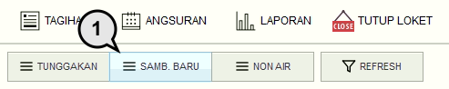
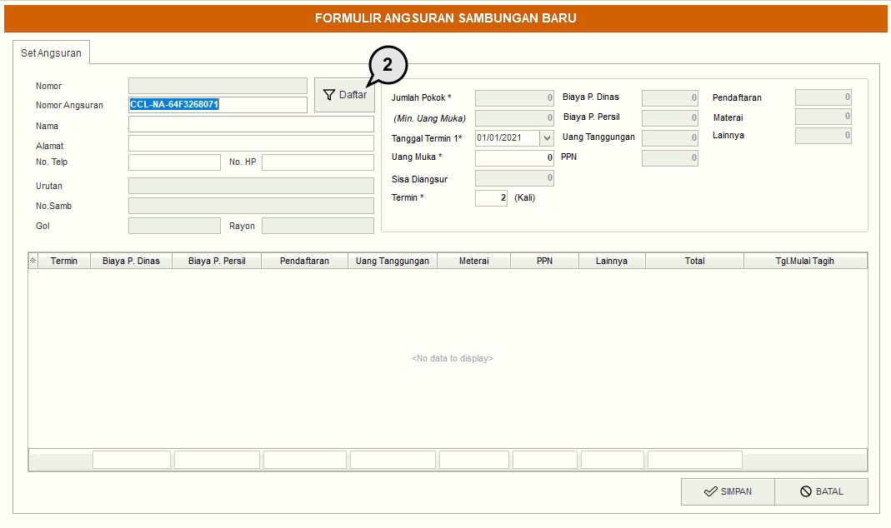
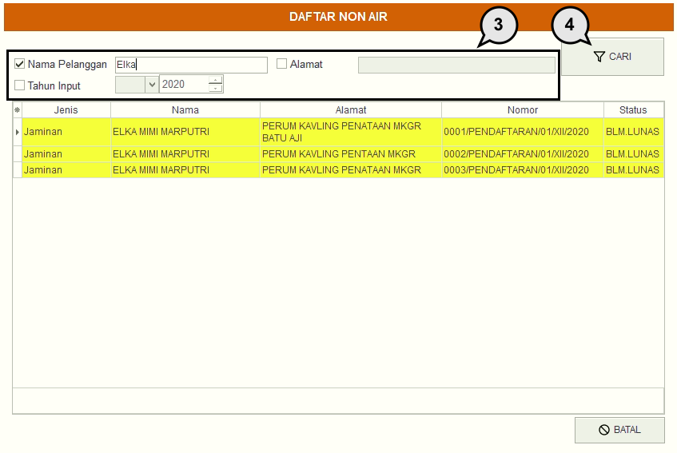
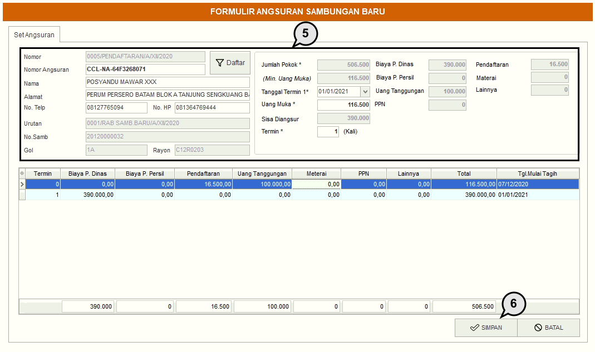

= Membuat Angsuran Sambungan Baru

Untuk membuat sambungan baru, silakan mengikuti langkah-langkah di bawah ini:

1. Pada menu *Angsuran*, pilih ikon *Sambungan Baru* untuk menampilkan detail pembuatan sambungan air baru.
+

2. Cari daftar pelanggan sambungan baru yang sudah terdata dengan menekan tombol *Daftar*.
+

3. Masukkan detail data pelanggan yang ingin dicari seperti *Nama Pelanggan*, *Tahun Input*, dan *Alamat*.
4. Selanjutnya, klik tombol *Cari* untuk mencari data calon pelanggan. Jika sudah, klik kiri mouse sebanyak 2x pada data calon pelanggan yang akan diproses
+

5. Masukkan data pelanggan, seperti *No Telepon*, *Tanggal Termin*, *Uang Muka*, *Jumlah Termin*, dan seterusnya.
6. Jika semua data sudah dimasukkan, klik pada tombol *Simpan* untuk memproses pembuatan angsuran sambungan baru.