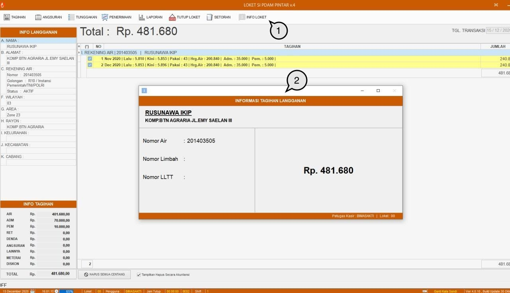

= Menampilkan Info Loket

Setelah memastikan detail data pelanggan pada menu *Tagihan*, kasir dapat menampilkan rincian tagihan kepada pelanggan dengan langkah-langkah berikut:

1. Klik pada menu *Info Loket*.
2. Data Informasi Tagihan Langganan akan ditampilkan sistem melalui _pop-up window_.
