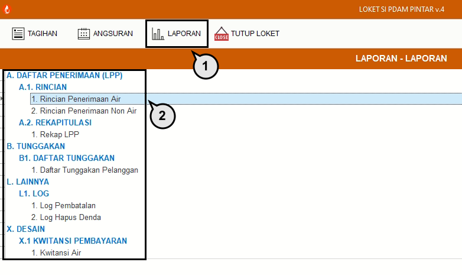
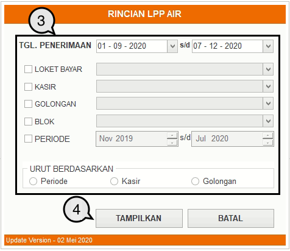
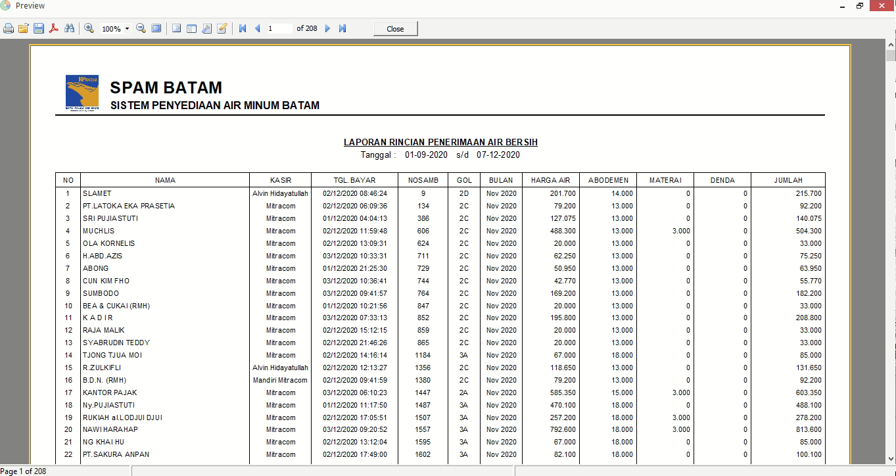

= Menampilkan Laporan

Menu ini digunakan untuk menampilkan berbagai laporan sesuai dengan kebutuhan. Ikuti langkah-langkah berikut untuk menampilkan laporan: 

1. Pilih menu *Laporan*
2. Pilih jenis laporan yang ingin ditampilkan dengan cara klik kiri mouse sebanyak 2x pada jenis laporan
+

3. Masukkan _filtering_ data laporan yang ingin ditampilkan berdasarkan *Tanggal Penerimaan*, *Loket Bayar*, *Kasir*, *Golongan*, dan *Periode Rekening*. 
4. Jika semua data sudah dimasukkan, untuk proses akhir menampilkan data, klik tombol *Tampilkan*.
+

5. Gambar di atas adalah salah satu contoh laporan yang ditampilkan. Anda dapat mencetak laporan tersebut dengan icon *print* pada _menu bar_.