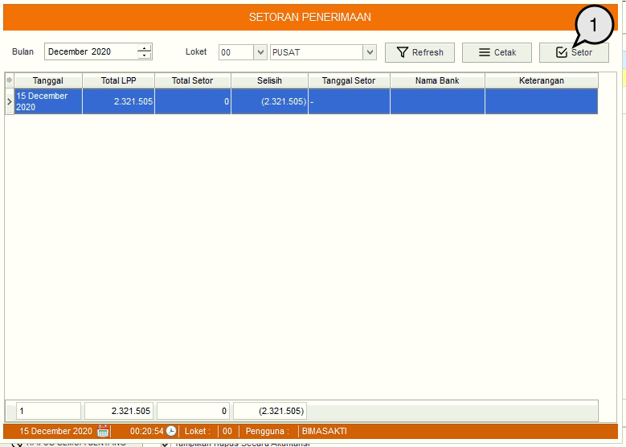
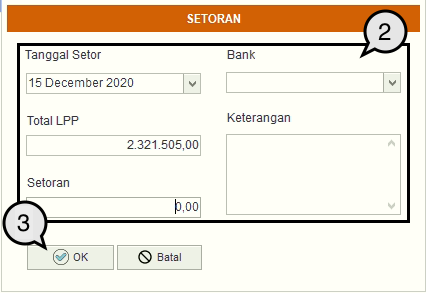
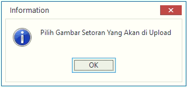

= Melakukan Setoran Penerimaan

Untuk melakukan setoran penerimaan, Anda dapat mengikuti langkah-langkah di bawah ini:

1. Klik tombol *Setor* untuk melakukan setoran penerimaan tagihan dari pelanggan.
+

2. Selanjutnya akan muncul form Setoran. Masukkan detail setoran yang ingin dilakukan seperti: *Tanggal Setor*, *Total LPP*, *Jumlah Setoran*, *Bank tujuan*, dan *Keterangan*.
+

3. Klik tombol *OK* untuk menyimpan
4. Selanjutnya pilih gambar bukti setoran, dan upload.