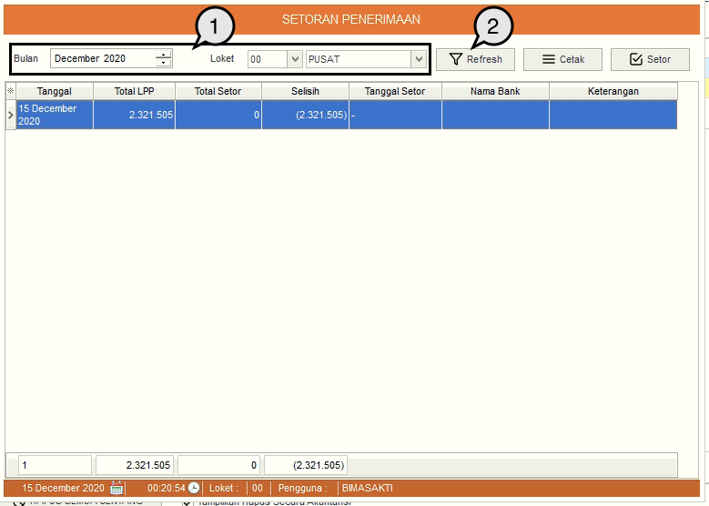

= Menampilkan Data Setoran Penerimaan

Anda dapat melakukan filter dan menampilkan data setoran dengan mengikuti langkah-langkah berikut:

1. Pilih kategori data yang dibutuhkan dengan filter, dapat berupa *Bulan / Tahun* dan *Label / Lokasi PDAM*
2. Klik tombol *Refresh* untuk menampilkan data sesuai kategori yang diinginkan
3. Selanjutnya data yang dibutuhkan akan ditampilkan pada tabel yang tersedia.