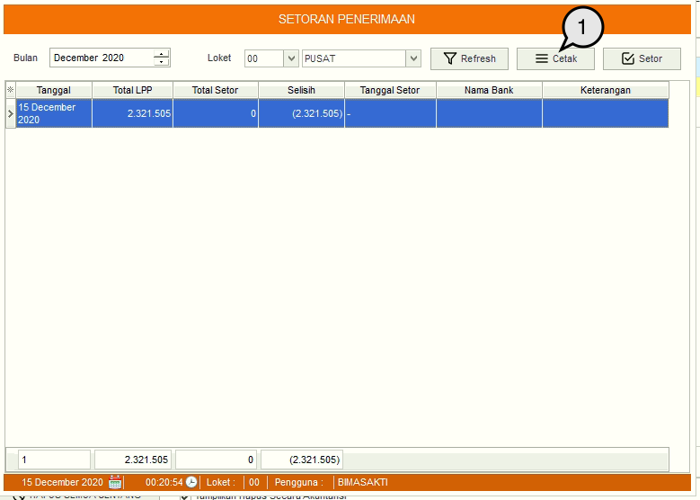
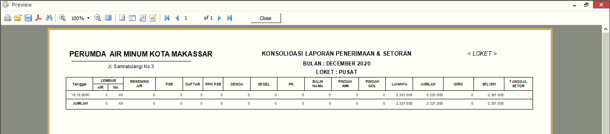

= Mencetak Data Setoran Penerimaan

Untuk mencetak data setoran penerimaan, Anda dapat mengikuti langkah-langkah di bawah ini:

1. Saat data setoran penerimaan telah ditampilkan, klik tombol *Cetak* untuk mencetak  laporan setoran penerimaan.
+

2. Gambar di atas adalah tampilan laporan setoran penerimaan. Anda dapat mencetak laporan tersebut dengan icon print pada menu bar.
