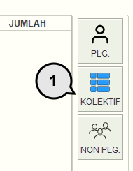
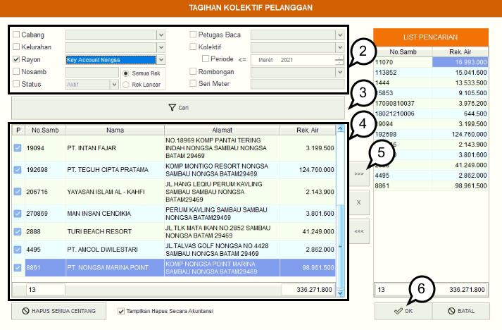
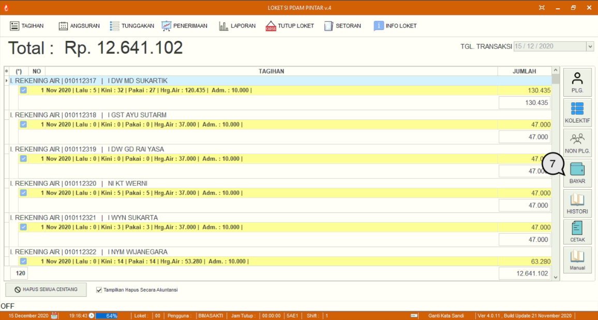
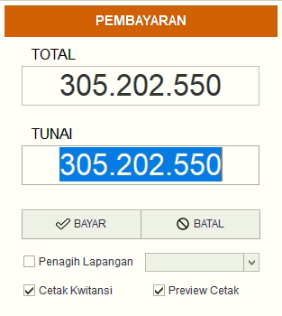

= Melakukan Pembayaran Air Secara Kolektif

Pembayaran air dapat dilakukan secara kolektif. Ikuti langkah-langkah berikut untuk melakukan pembayaran:

1. Pada menu *Tagihan* pilih ikon *Kolektif* untuk menampilkan detail pembuatan Rekening air kolektif
+

2. Centang *kategori pencarian* yang ingin Anda gunakan, baik berdasarkan *Cabang*, *Kelurahan*, *Rayon*, *No Sambungan*, *Status*, *Petugas Baca*, *Kolektif* maupun *Rombongan*.
3. Setelah itu tekan tombol *Cari* untuk melakukan pencarian data pelanggan.
4. Pilih data pelanggan yang ingin Anda proses dengan memberikan centang. 
5. Jika sudah, Anda dapat menekan ikon *Panah >>>>*.
6. Jika semua pelanggan sudah terpilih, tekan tombol *OK*
+

7. Rincian tagihan secara otomatis akan muncul, untuk melanjutkan pada proses pembayaran, tekan ikon *Bayar*. 
+

8. Selanjutnya, masukkan nominal pembayaran dan tekan tombol *Bayar*. Jika Anda ingin mencetak kwitansi pembayaran dan melihat hasilnya, Anda dapat memberikan tanda centang _checkbox_ *Cetak Kwitansi* dan *Preview Kwitansi*.