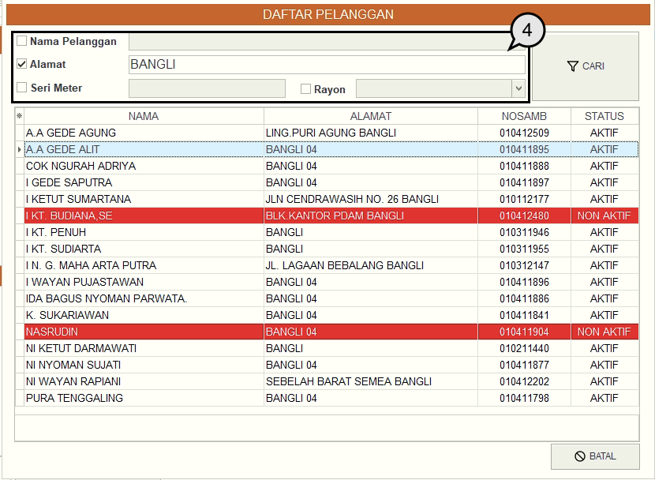

= Melakukan Pembayaran Tagihan Air

Di bawah ini merupakan langkah-langkah pembayaran Rekening air. 

1. Pada menu Tagihan pilih ikon *PLG* untuk mencari detail data pelanggan air
+

2. Masukkan *Nomor Sambungan* pelanggan

3. Jika tidak mengetahui nomor sambungan, Anda dapat mencari pada daftar pelanggan dengan cara menekan tombol *Daftar*. 
+

4. Selanjutnya centang kategori pencarian yang ingin Anda gunakan, masukan kata kunci, bisa menggunakan Nama Pelanggan, Alamat, dan Seri Meter. Selanjutnya tekan tombol *Cari*.  Jika kata kunci yang Anda masukan benar, maka data otomatis akan muncul. Pilih data dengan cara klik kiri pada mouse sebanyak 2x.
+

5. Jika sudah, Anda dapat menekan tombol *OK* untuk menampilkan tagihan yang diinginkan. 
+

6. Rincian tagihan secara otomatis akan muncul. Tagihan yang muncul ini adalah tagihan rekening yang telah dikoreksi dan sudah diproses untuk di upload di loket. Untuk melanjutkan pada proses pembayaran, Anda dapat menekan ikon *Bayar*.  
+

7. Selanjutnya masukan nominal pembayaran dan tekan tombol *Bayar*. Jika Anda ingin mencetak kwitansi pembayaran. 
+

8. Berikut adalah salah satu contoh dari kwitansi pembayaran
