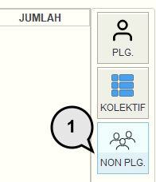
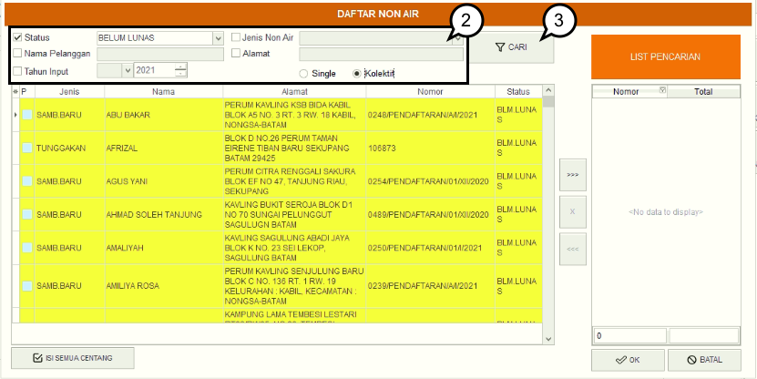
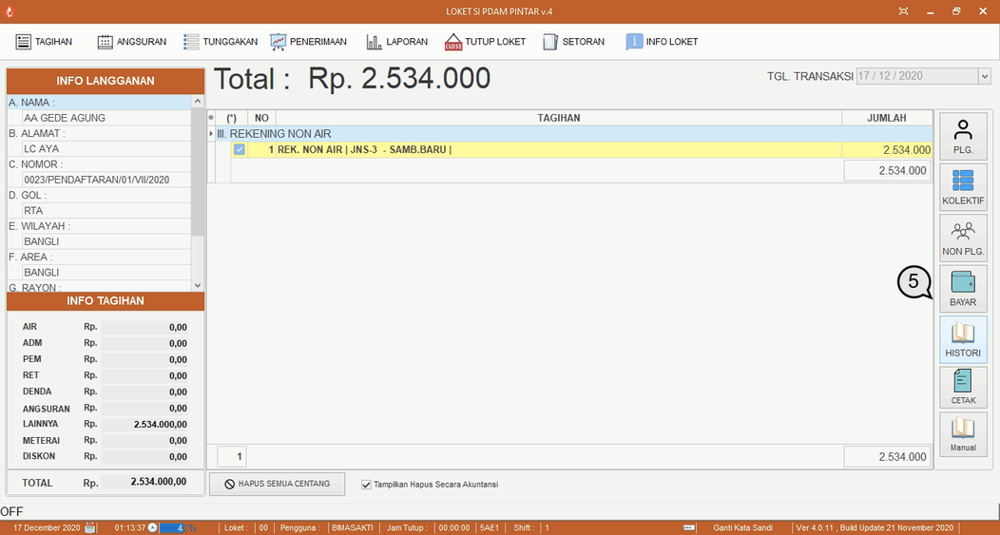
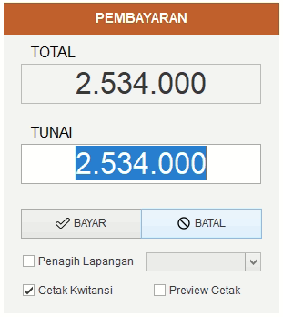
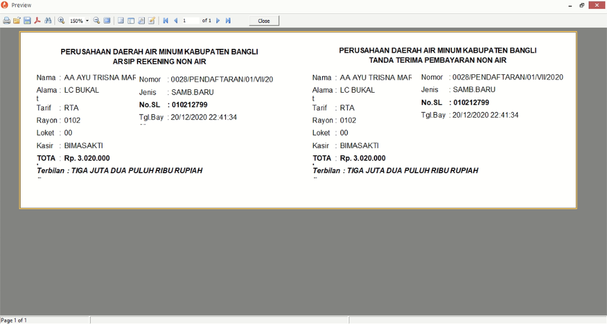

= Melakukan Pembayaran Tagihan Non Air

Berikut adalah langkah-langkah melakukan pembayaran non air:

1. Pada menu Tagihan pilih ikon *Non PLG* untuk menampilkan detail tagihan non air pelanggan atau non pelanggan.
+

2. Selanjutnya centang kategori pencarian yang ingin Anda gunakan, masukan kata kunci, bisa menggunakan *Status*, *Nama Pelanggan*, *Tahun Input*, *Jenis Non Air*, dan *Alamat*. Selanjutnya pilih jenis pembayaran yang diinginkan, *Single* untuk pembayaran tiap sambungan atau *Kolektif* untuk pembayaran lebih dari 1 sambungan.
3. Selanjutnya Anda dapat menekan tombol *Cari*
4. Jika kata kunci yang Anda masukkan benar, secara otomatis data pelanggan akan muncul. Selanjutnya klik 2x pada data pelanggan yang ingin diproses.
+

5. Rincian tagihan secara otomatis akan muncul, untuk melanjutkan pada proses pembayaran, Anda dapat menekan ikon *Bayar* 
+

6. Selanjutnya masukan nominal pembayaran dan tekan tombol *Bayar*. Jika Anda ingin mencetak kwitansi pembayaran.
+

7. Anda dapat juga menampilkan preview cetak dengan memberikan centang (check) pada field preview cetak. Berikut adalah contoh preview dari kwitansi pembayaran.
